<p align="center">
  <br><br>
  Predstavitev: <a href="./assets/predstavitev.pdf"></a><br>
  Predstavitev SPARQL: <a href="./assets/predstavitev-SPARQL.pdf"></a><br>
</p>

# Delavnice semantičnega opisovanja podatkov

## Osnovni podatki

<details>
<summary>Prikaži podrobnosti</summary>

### Termini

**9. februar 2026** in **12. februar 2026** od 9:00 do 13:00 po MS Teams.

### Ciljna skupina

Zaposleni v javnem sektorju, ki želijo napredovati na področju semantičnega opisovanja podatkov in izboljšati interoperabilnost svojih podatkovnih zbirk.

### Cilji delavnice

- Omogočiti osnovno razumevanje semantične interoperabilnosti in pomena odprtih podatkov.
- Usposobiti udeležence za pretvorbo podatkov v odprte in semantično opisane formate (CSV, RDF/TTL).
- Okrepiti razumevanje uporabe URI-jev, trojčkov RDF in ontologij ter uporabo osnovnih orodij (npr. [Protégé](https://protege.stanford.edu/)).
- Spodbuditi uporabo povezanih podatkov in integracijo podatkov iz različnih virov (npr. SURS, CRP, OSM, Wikidata ipd.).
- Omogočiti izvajanje osnovnih poizvedb SPARQL ter razumevanje, kako sklepanje prinaša dodatno znanje.

### Zahteve

#### Predznanje

- Osnovno znanje o podatkovnih bazah.
- Poznavanje formatov CSV, JSON in načinov zapisovanja podatkov z omenjenima formatoma.

#### Programska oprema

- Lokalno nameščeno orodje [Protégé](https://protege.stanford.edu/) ali dostop do [WebProtégé](https://webprotege.stanford.edu/).
- Lokalno nameščeno orodje za delo z besedilnimi datotekami (npr. [VS Code](https://code.visualstudio.com/), [Notepad++](https://notepad-plus-plus.org/), [Sublime Text](https://www.sublimetext.com/) ipd.).
- Lokalno nameščena podpora za [Docker](https://docs.docker.com/desktop/) za izvajanje SPARQL poizvedb in sklepanje.

### Izvajalca

**dr. Slavko Žitnik** in **dr. Dejan Lavbič**

### Financiranje

Naročilo sofinancirata Republika Slovenija in Evropska unija iz Načrta za okrevanje in odpornost (NOO), komponenta Digitalne preobrazbe javnega sektorja in javne uprave (C2K7), ukrep Razvoj novih dinamičnih e-storitev.

</details>

## Vsebina

### 1. Uvod: Zakaj semantično opisovanje podatkov?

<p align="left">
  
</p>

<details>
<summary>Prikaži podrobnosti</summary>

#### 1.1 Namen delavnice

V okviru delavnice želimo **praktično pojasniti**:

- zakaj klasično objavljanje podatkov ni dovolj,
- kako doseči višje ravni odprtosti podatkov,
- kakšen problem semantično opisovanje dejansko rešuje,
- zakaj je to še posebej pomembno za javni sektor.

Poudarek ni na tehnologiji, temveč na **problemu in dodani vrednosti**, ki jo semantično opisovanje prinaša.

#### 1.2 Motivacijski problem

Realni problem, s katerim se srečamo, je situacija, kjer podatki obstajajo, vendar iz njih težko pridobimo željene odgovore.

Primer takšnega realnega vprašanja je:

> _"Katere občine imajo največ prebivalcev, katere šole imajo tam sedež in kakšna je nadmorska višina teh območij?"_

Podatki sicer že obstajajo, vendar:

- so **razpršeni** po različnih institucijah (CRP, SURS, MIZŠ, OSM, Wikidata),
- uporabljajo **različne identifikatorje**, **poimenovanja** in **strukture**,
- **niso** neposredno medsebojno **povezljivi**.

Z eno datoteko Excel ali CSV **tega vprašanja ne moremo rešiti**. Zato potrebujemo nek način, kjer podatki "govorijo isti jezik", se lahko povezujejo in so računalniku razumljivi. V tem kontekstu je **semantično opisovanje podatkov ključnega pomena**.

#### Od podatkov do znanja

Pogosto strukturirane podatke napačno interpretiramo kot semantično bogate podatke. To ne drži, saj moramo jasno razlikovati, da **struktura ne predstavlja pomena**.

| Pojem           | Primer                                                                                                                                                    |
| :-------------- | :-------------------------------------------------------------------------------------------------------------------------------------------------------- |
| **podatek**     | `298000`                                                                                                                                                  |
| **informacija** | Število prebivalcev Ljubljane.                                                                                                                            |
| **metapodatek** | Kaj ta številka pomeni, za katero leto, vir, metodologija.                                                                                                |
| **znanje**      | Sklepanje, povezovanje, odgovori na kompleksna vprašanja, npr. Ljubljana je največje mesto v Sloveniji z 298.000 prebivalci (podatki iz leta 2023, SURS). |

Zgornji primer jasno pokaže da lepo strukturirana datoteka CSV ne pove, kaj stolpci dejansko pomenijo. Struktura ≠ semantika. Brez opredeljenega pomena računalnik podatkov ne razume in jih ne more povezovati.

#### 1.3 Zakaj je to pomembno za javni sektor?

Javni sektor upravlja z **veliko količino podatkov**, ki se pogosto zbirajo večkrat, niso ponovno uporabni, niso pripravljeni za povezovanje.

Semantična interoperabilnost pri tem prinaša številne koristi, in sicer zmanjšuje podvajanje, omogoča ponovno uporabo podatkov in podpira podatkovno podprto odločanje.

Omenjen pristop je tesno povezan s strategijami in načeli, predstavljenimi v dokumentu **Podatkovnih semantičnih smernic** - cilji digitalne preobrazbe, pomenom interoperabilnosti, načeli FAIR (**F**indable, **A**ccessible, **I**nteroperable, **R**eusable) in odprtih podatkov.

#### 1.4 Kaj semantično opisovanje ni?

O semantičnem opisovanju podatkov pogosto obstajajo napačne predstave. Tukaj je nekaj **pogostih zmot**:

- ❌ _"To je samo za raziskovalce."_
- ❌ _"To pomeni, da moramo najprej narediti ontologijo."_
- ❌ _"To je preveč kompleksno za praktično uporabo."_

Ključno vodilo delavnice je:

> _Ne gradimo ontologije - rešujemo problem povezovanja podatkov za namen odgovarjanja na kompleksna vprašanja._

#### 1.5 Intuitivne razlage ključnih pojmov

Pri delavnici bomo uporabljali preproste in intuitivne razlage ključnih pojmov, kot so:

| Pojem                                    | Razlaga                                                                                                                                                                                                                                    |
| :--------------------------------------- | :----------------------------------------------------------------------------------------------------------------------------------------------------------------------------------------------------------------------------------------- |
| **URI (Uniform Resource Identifier)**    | Enoličen in nespremenljiv naslov (ne le ID v tabeli), ki identificira vir (npr. občino, šolo) na spletu.                                                                                                                                   |
| **RDF (Resource Description Framework)** | Način, kako računalniku predstavimo "kdo je kdo, kako so stvari povezane" z uporabo trojčkov (subjekt, predikat, objekt).                                                                                                                  |
| **Ontologija**                           | Formalen opis pojmov in njihovih medsebojnih odnosov v določenem področju (npr. občine, šole).                                                                                                                                             |
| **SPARQL**                               | Jezik za poizvedovanje po semantično opisanih podatkih. Npr. Google (v kontekstu spletnih strani) oz. SQL (v kontekstu relacijskih baz) za grafovsko urejene podatke.                                                                      |
| **Povezani podatki (Linked Data)**       | Podatki, ki so medsebojno povezani z uporabo URI-jev, kar omogoča integracijo in kontekstualizacijo iz različnih virov. Način, s katerim lahko samodejno pridobimo podatke iz zunanjih virov (npr. [Wikidata](https://www.wikidata.org/)). |

#### 1.6 Praktični primer

Če pogledamo poljuben članek na spletni strani [RTV Slovenije](https://www.rtvslo.si/), npr. [Zadnji dan za odpiranje transakcijskih računov za predvolilne kampanje](https://www.rtvslo.si/slovenija/zadnji-dan-za-odpiranje-transakcijskih-racunov-za-predvolilne-kampanje/772271), lahko opazimo, da je delno semantično opisan z namenom olajšanja iskanja in povezovanja vsebin, kot to prikazuje naslednja slika.

<p align="center">
  <br>
  Vizualizacija novice iz <a href="https://www.rtvslo.si/slovenija/zadnji-dan-za-odpiranje-transakcijskih-racunov-za-predvolilne-kampanje/772271" target="_blank">RTV SLO</a>
</p>

Izvorna koda novice iz [RTV SLO](https://www.rtvslo.si/slovenija/zadnji-dan-za-odpiranje-transakcijskih-racunov-za-predvolilne-kampanje/772271) vsebuje naslednji del z uporabo [JSON-LD](https://json-ld.org/) za semantično opisovanje vsebine novice:

```html
<!DOCTYPE html>
<html lang="sl">
  <head>
    ...
    <script type="application/ld+json">
      {
        "@context": "https://schema.org",
        "@type": "NewsArticle",
        "mainEntityOfPage": {
          "@type": "WebPage",
          "@id": "https://www.rtvslo.si/slovenija/zadnji-dan-za-odpiranje-transakcijskih-racunov-za-predvolilne-kampanje/772271"
        },
        "headline": "Zadnji dan za odpiranje transakcijskih računov za predvolilne kampanje",
        "image": [
          "https://img.rtvcdn.si/_up/upload/2025/11/23/66997310_fp-fb.jpg"
        ],
        "datePublished": "2026-02-04 07:25:17",
        "dateModified": "2026-02-04 07:33:56",
        "author": {
          "@type": "Person",
          "name": "G. K.",
          "url": "https://www.rtvslo.si"
        },
        "publisher": {
          "@type": "Organization",
          "name": "RTV Slovenija",
          "logo": {
            "@type": "ImageObject",
            "url": "https://img.rtvslo.si/_static/novi/logo/md_RTVSLO-logo-color.png"
          }
        }
      }
    </script>
  </head>
  <body>
    ...
  </body>
</html>
```

Opazimo lahko, da je novica semantično opisana z uporabo standarda [schema.org](https://schema.org/), ki omogoča enostavno razumevanje vsebine tako ljudem kot računalnikom, kar se pogosto uporablja pri objavi splošnih podatkov na svetovnem spletu.

V tem konkretnem primeru so uporabljeni pojmi, kot so [`NewsArticle`](https://schema.org/NewsArticle) (novica), [`headline`](https://schema.org/headline) (naslov), [`image`](https://schema.org/image) (slika), [`datePublished`](https://schema.org/datePublished) (datum objave), [`author`](https://schema.org/author) (avtor) in [`publisher`](https://schema.org/publisher) (izdajatelj). Ti pojmi omogočajo strukturirano predstavitev ključnih informacij o novici, kar olajša iskanje, indeksiranje in povezovanje z drugimi vsebinami na spletu.

Poznamo pa še številne druge formalne opredelitve v obliki besednjakov in ontologij, kot so npr. [**F**riend **O**f **A** **F**riend (**FOAF**)](http://xmlns.com/foaf/spec/), [**D**ublin **C**ore (**DC**)](https://www.dublincore.org/specifications/dublin-core/dcmi-terms/), [**S**imple **K**nowledge **O**rganization **S**ystem (**SKOS**)](https://www.w3.org/TR/skos-reference/), in seveda [**D**ata **CAT**alog Vocabulary (**DCAT**)](http://www.w3.org/ns/dcat#), ki se uporablja predvsem na področju podatkovnih naborov podatkov.

</details>

### 2. Od izvornih podatkov (1 ★) do odprtih podatkov (3 ★)

<p align="left">
  
</p>

<details>
<summary>Prikaži podrobnosti</summary>

#### 2.1 Ravni odprtosti podatkov

Cilj delavnice je pojasniti, kako iz razdrobljenih javnih podatkov dobimo odgovore, ki jih iz posamezne zbirke ne moremo pridobiti. Pri tem pogosto govorimo o [ravneh odprtosti podatkov](https://5stardata.info/), predstavljene v naslednji tabeli.

| Raven | Opis                                                                                   | Primer                                                                                    |
| :---- | :------------------------------------------------------------------------------------- | :---------------------------------------------------------------------------------------- |
| ★     | Podatki so objavljeni na spletu (v poljubnem formatu) pod odprto licenco.              | Poročilo v obliki PDF o občinskih proračunih na spletni strani občine.                    |
| ★★    | Podatki so strukturirani (npr. Excel namesto skeniranega dokumenta).                   | Excel tabela z javnimi naročili.                                                          |
| ★★★   | Podatki so v odprtem formatu (npr. CSV namesto Excel).                                 | Datoteka CSV s statistiko prebivalstva iz SURS-a.                                         |
| ★★★★  | Podatki uporabljajo URI-je za enolično identifikacijo pojmov, kar omogoča povezovanje. | Nabor podatkov o občinah, kjer ima vsaka občina svoj URI.                                 |
| ★★★★★ | Podatki so povezani z drugimi viri, kar omogoča kontekstualizacijo.                    | Podatki o šolah, povezani z prostorskimi podatki, standardi izobraževanja in demografijo. |

Model 5 ★ odprtosti podatkov nam pomaga razumeti, **zakaj zgolj objava podatkov še ne pomeni, da so ti uporabni**. Vsaka zvezdica predstavlja **konkreten kvalitativni preskok**, kjer vsaka naslednja zvezdica predpostavlja izpolnitev pogojev prejšnje. Največja dodana vrednost pa se pojavi pri 4 ★ in 5 ★, kjer podatki postanejo medsebojno povezljivi in kontekstualizirani. Na žalost večina podatkov dandanes obstaja na ravni 2 ★ ali 3 ★, kar močno omejuje njihovo uporabnost.

#### 2.2 Izvorni podatki (1 ★ in 2 ★): ko podatki obstajajo, a niso uporabni

Za začetek si poglejmo podatke o Centralnem registru prebivalstva (**CRP**) iz [NIO](https://nio.gov.si/sl/products/nio%2Bcentralni%2Bregister%2Bprebivalstva%2Bcrp%2Bvpogled%2Bpreko%2Bemso?release=0.1), ki so na voljo v naslednjih Excel datotekah:

> [📊 `Nabor podatkov NIO CRP.xls`](./assets/data/raw/CRP/Nabor%20podatkov%20NIO%20CRP.xls)  
> [📊 `Sifranti IO CRP.xls`](./assets/data/raw/CRP/Sifranti%20IO%20CRP.xls)

📊 `Sifrant IO CRP.xls` v zavihku `Občine` vsebuje šifrant občin z naslednjimi podatki:

| OBC_ID | OBC_IME_SLO_MLC |
| ------ | --------------- |
| 1      | Ajdovščina      |
| 2      | Beltinci        |
| 3      | Bled            |
| 4      | Bohinj          |
| 5      | Borovnica       |
| 6      | Bovec           |
| 7      | Brda            |
| 8      | Brezovica       |
| 9      | Brežice         |
| 10     | Tišina          |
| ...    | ...             |

Po pregledu podatkov opazimo:

- podatki so **razpršeni po več datotekah in zavihkih**,
- pomen stolpcev **ni jasno razložen** (npr. kaj pomeni `4` v stolpcu `OBC_ID` in v katerem registru je enolična oznaka; ali je ta oznaka nespremenljiva in uporabna tudi izven Excel datoteke?),
- podatki so predstavljeni **brez konteksta**,
- iste vrednosti se lahko nanašajo na **različne koncepte** (npr. `Ljubljana` kot občina, naselje, upravna enota), ker ni eksplicitne definicije pojma.

Gre za tipičen primer, kjer so podatki objavljeni (1 ★) in strukturirani (2 ★), vendar brez jasnega pomena in konteksta, kar onemogoča njihovo učinkovito uporabo in zato **niso interoperabilni**.

> Excel datoteka je primerna za uporabniško branje, ne pa za povezovanje podatkov.

#### 2.3 Prehod v odprti format (3 ★): CSV kot prvi korak k tehnični interoperabilnosti

Naslednji korak je pretvorba podatkov v **odprt** in **strojno berljiv format**, kot je CSV. To omogoča lažjo obdelavo in izmenjavo podatkov med različnimi sistemi.

Format CSV je preprost besedilni format, kjer so podatki organizirani v vrstice in stolpce, ločene z vejicami ali drugimi ločili (npr. `;`). Vsaka vrstica predstavlja en zapis, prvi vrstici pa običajno vsebujejo imena stolpcev. Je odprt standard, neodvisen od orodij, primeren za avtomatsko obdelavo in podprt praktično v vseh okoljih.

V nadaljevanju bomo podatke iz Excela izvozili v podatke CSV, odstranili nepotrebne zavihke, poenotili kodiranje (UTF-8) in zagotovili konsistentna imena stolpcev.

```csv
OBC_ID;OBC_IME_SLO_MLC;OBC_DTM_UKN
1;Ajdovščina;
2;Beltinci;
3;Bled;
4;Bohinj;
5;Borovnica;
6;Bovec;
7;Brda;
8;Brezovica;
9;Brežice;
10;Tišina;
...
```

S tem postopkom zapisa v obliki CSV smo **izboljšali dostopnost**, **ne** pa še **pomena**.

> **Struktura ≠ semantika.** Brez opredeljenega pomena računalnik podatkov ne razume in jih ne more povezovati.

#### 2.4 Primer zunanjega vira: podatki SURS (3 ★)

Nadaljujemo s podatki Statističnega urada Republike Slovenije (**SURS**), ki so na voljo na [portalu odprtih podatkov SURS](https://www.stat.si/obcine/sl/Theme/Index/PrebivalstvoStevilo), med tematskimi članki o prebivalstvu. Če želimo pridobiti podatke o številu prebivalcev po občinah za leto 2025 lahko s klikom na [zemljevid](https://gis.stat.si/#) zahtevamo podrobnjši pregled, kjer vnesemo omejitve za leto 2025 in zahtevamo prenos. Ker potrebujemo zgolj podatke o številu prebivalcev, zahtevamo **Prenesi CSV tabelo**, kjer dobimo naslednjo vsebino:

- Datoteka ZIP 📦 `STAGE_data.zip` z naslednjimi datotekami:
  - [📊 `data.tsv`](./assets/data/raw/SURS/2025/data.tsv),
  - [📄 `info.html`](./assets/data/raw/SURS/2025/info.html),
  - [📝 `info.txt`](./assets/data/raw/SURS/2025/info.txt).

`data.tsv`

```tsv
ob_id ob_ime              tot_p
001   Ajdovščina          19895
213   Ankaran             3446
195   Apače               3563
002   Beltinci            8129
148   Benedikt            2738
149   "Bistrica ob Sotli" 1335
003   Bled                8154
150   Bloke               1554
004   Bohinj              5238
```

Datoteka `info.txt` sama po sebi vsebuje zgolj **vrednosti** in **kratice stolpcev**, katerih pomen iz same strukture ni razviden. Brez dodatnega konteksta računalnik (in pogosto tudi človek) ne ve, kaj posamezen stolpec predstavlja.

Vlogo tega konteksta v primeru podatkov SURS predstavlja datoteka `info.txt` z **zunanjim opisom podatkovnega modela**. V njej so za vsak stolpec navedeni polni nazivi pojmov v slovenskem in angleškem jeziku ter hierarhična umestitev kazalnika.

`info.txt`

```txt
ACRONYM        English                                           Slovenian
-------------------------------------------------------------------------------------------------------------------
tot_p          Population > number of population > total         Prebivalstvo > število prebivalcev > skupaj
```

Ta primer lepo ponazarja ključno lastnosti ravni 3 ★, kjer so podatki odprti in strojno berljivi, medtem ko **pomen** podatkov **ni del podatkov samih**, ampak je **zapisan ločeno** v spremljajoči dokumentaciji.

Za računalniško obdelavo pomeni, da je treba `info.txt` interpretirati ročno ali z dodatno logiko, saj ni enolične, formalne povezave med stolpci in pomenom. Podatki še vedno niso neposredno primerni za avtomatsko povezovanje z drugimi viri.

#### 2.5 Omejitve ravni 3 ★

Na tej točki smo zdaj posamezne podatke (CRP in SURS) pretvorili v odprt format (CSV). Kako zdaj ta nabora podatkov medsebojno povežemo?

Pojavijo se namreč naslednje težave:

- ni skupnega identifikatorja (npr. `OBC_ID` v CRP ni popolnoma enak `ob_id` v SURS),
- imena se razlikujejo (npr. `OBC_IME_SLO_MLC` v CRP in `ob_ime` v SURS),
- ni jasne definicije pojma (občina, pošta, upravna enota, naselje),
- računalnik pri samodejni obdelavi ne razume, da `Ajdovščina` v CRP in `Ajdovščina` v SURS predstavljata isto občino.

Npr. `Ajdovščina` ima v CRP `OBC_ID=1`, v SURS pa `ob_id=001`. Človeški uporabnik to zlahka ugane, računalnik pa brez dodatnih informacij (npr. pravil oz. semantike) ne more vedeti, da gre za isti entiteti.

> Pri 3 ★ smo s formatom CSV dosegli strojno berljivost in odprt format, vendar podatki še vedno **nimajo enoličnih identifikatorjev** in **formalno opredeljenega pomena**. Zato v naslednjem poglavju uvedemo **URI-je** in **RDF**, da omogočimo povezovanje in semantično interoperabilnost.

</details>

### 3. Raven 4 ★: semantični opis podatkov z RDF

<p align="left">
  
</p>

<details>
<summary>Prikaži podrobnosti</summary>

#### 3.1 Zakaj CSV ni več dovolj?

V tem koraku naredimo **ključni preskok** od zgolj odprtih in strojno berljivih podatkov (3 ★) k **semantično opisanim podatkom** (4 ★). RDF, ki ga bomo uporabili, podatkom ne doda nove vsebine, temveč jasen in strojno razumljiv pomen.

Kot primer lahko izpostavimo `Ajdovščina` v CRP in `Ajdovščina` v SURS, ki za človeškega uporabnika pomenita isto občino, za računalnik pa gre zgolj za **enak niz znakov**, brez pomena.

Če želimo rešiti ta problem, moramo vpeljati:

- **enolične identifikatorje** (URI-je), ki bodo jasno določili, da gre za isto entiteto,
- **formalni opis pomena** (to kasneje zajamemo z ontologijo), ki bo opredelila, kaj je občina, kakšne so njene lastnosti in kako se povezuje z drugimi pojmi,
- **model, ki presega tabelarično strukturo** in omogoča predstavitev kompleksnih odnosov med pojmi (RDF).

#### 3.2 RDF: opis podatkov v obliki trojčkov

[**RDF** (Resource Description Framework)](https://www.w3.org/RDF/) je standard za predstavitev podatkov v obliki **trojčkov**:

- **osebek** _(angl. subject)_ - kaj opisujemo (npr. `Občina Ajdovščina`),
- **povedek** _(angl. predicate)_ - katero lastnost opisujemo (npr. `ima število prebivalcev`),
- **predmet** _(angl. object)_ - vrednost ali povezava (npr. `19895`).

Takšna struktura omogoča eksplicitno izražati pomen, povezovanje podatkov v graf in razširljivost brez spremembe obstoječih zapisov.

#### 3.3 URI: enolična identifikacija pojmov

Osnova jezika RDF je uporaba URI-jev, ki predstavljajo stabilne, globalno enolične in spletno naslovljive identifikatorje.

Namesto npr. `OBC_ID=1` uporabimo npr. `https://onto.mdp.gov.si/obcina/ajdovscina`, ki jasno identificira občino Ajdovščina. S tem odpravimo dvoumnost, omogočimo povezovanje z drugimi viri in jasno ločimo pojem od njegovega zapisa v tabeli.

> **URI ni le identifikator** - je nosilec pomena, ki omogoča povezovanje in integracijo podatkov iz različnih virov.

#### 3.4 Zapis RDF v obliki Turtle (TTL)

RDF podatke lahko zapišemo v različnih formatih, eden izmed najbolj berljivih je **Turtle (TTL)**, ker je človeško berljiv in pogosto uporabljen v praksi.

Osredotočimo se na podatke v obliki TSV, ki smo jih izvozili iz SURS-a:

`data.tsv`

```tsv
ob_id ob_ime              tot_p
001   Ajdovščina          19895
213   Ankaran             3446
195   Apače               3563
002   Beltinci            8129
148   Benedikt            2738
149   "Bistrica ob Sotli" 1335
003   Bled                8154
150   Bloke               1554
004   Bohinj              5238
```

V TSV datoteki so stolpci ločeni s tabulatorji (ne s presledki). Vsaka vrstica predstavlja eno občino, stolpci pa njene lastnosti. Pri pretvorbi v RDF bomo vsako vrstico pretvorili v več trojčkov: en trojček za tip entitete (npr. `shema:Obcina`) in po en trojček za vsako lastnost (npr. naziv, število prebivalcev).

Za razumevanje trojčkov je koristen “polni” zapis s celotnimi URI-ji. V praksi pa skoraj vedno uporabimo predpone (`@prefix`), da je zapis bistveno bolj berljiv.

Sedaj v RDF obliko s serializacijo v TTL zapišimo podatke o prvi občini, `Ajdovščina`:

```turtle
https://onto.mdp.gov.si/obcina/ajdovscina http://www.w3.org/1999/02/22-rdf-syntax-ns#type https://onto.mdp.gov.si/shema/Obcina .
https://onto.mdp.gov.si/obcina/ajdovscina https://onto.mdp.gov.si/shema/idObcinaSurs "001" .
https://onto.mdp.gov.si/obcina/ajdovscina https://onto.mdp.gov.si/shema/naziv "Ajdovščina" .
https://onto.mdp.gov.si/obcina/ajdovscina https://onto.mdp.gov.si/shema/steviloPrebivalcev 19895 .
```

Pri zapisu v obliko trojčkov smo si izbrali URI `https://onto.mdp.gov.si/obcina/ajdovscina` za identifikacijo občine Ajdovščina, lastnosti `https://onto.mdp.gov.si/shema/idObcinaSurs` za SURS-ov enolični identifikator, `https://onto.mdp.gov.si/shema/naziv` za poimenovanje in `https://onto.mdp.gov.si/shema/steviloPrebivalcev` za število prebivalcev. Uporabili smo tudi standardni RDF predikat `http://www.w3.org/1999/02/22-rdf-syntax-ns#type`, da opredelimo, da gre za entiteto tipa `Obcina`.

Opazimo, da je `https://onto.mdp.gov.si/shema/steviloPrebivalcev` številska vrednost, zato je zapisana brez narekovajev, medtem ko sta `https://onto.mdp.gov.si/shema/idObcinaSurs` in `https://onto.mdp.gov.si/shema/naziv` besedilni vrednosti in sta zapisani z narekovaji. V RDF zapisu so to [literali](https://www.w3.org/TR/rdf11-concepts/#section-Graph-Literal); tipe (npr. `xsd:integer` ali `xsd:string`) lahko kasneje tudi eksplicitno določimo.

V praksi bomo za vsako občino hranili oba identifikatorja (npr. šifro CRP in SURS) kot lastnosti iste entitete. S tem naredimo prvi korak k usklajevanju virov, ne da bi podatke podvajali.

> Če na podatke v CSV obliki gledamo kot 2D tabelo, potem posamezno vrstico tabele pretvorimo v več RDF trojčkov, kjer vsak stolpec predstavlja lastnost, vrstica pa subjekt (entiteto). S tem smo podatke iz tabelarične oblike pretvorili v grafovno obliko, ki omogoča bolj fleksibilno predstavitev in povezovanje podatkov.

Dodamo lahko še nekaj dodatnih občin:

```turtle
https://onto.mdp.gov.si/obcina/ajdovscina http://www.w3.org/1999/02/22-rdf-syntax-ns#type https://onto.mdp.gov.si/shema/Obcina .
https://onto.mdp.gov.si/obcina/ajdovscina https://onto.mdp.gov.si/shema/idObcinaSurs "001" .
https://onto.mdp.gov.si/obcina/ajdovscina https://onto.mdp.gov.si/shema/naziv "Ajdovščina" .
https://onto.mdp.gov.si/obcina/ajdovscina https://onto.mdp.gov.si/shema/steviloPrebivalcev 19895 .

https://onto.mdp.gov.si/obcina/ankaran http://www.w3.org/1999/02/22-rdf-syntax-ns#type https://onto.mdp.gov.si/shema/Obcina .
https://onto.mdp.gov.si/obcina/ankaran https://onto.mdp.gov.si/shema/idObcinaSurs "213" .
https://onto.mdp.gov.si/obcina/ankaran https://onto.mdp.gov.si/shema/naziv "Ankaran" .
https://onto.mdp.gov.si/obcina/ankaran https://onto.mdp.gov.si/shema/steviloPrebivalcev 3446 .

https://onto.mdp.gov.si/obcina/apace http://www.w3.org/1999/02/22-rdf-syntax-ns#type https://onto.mdp.gov.si/shema/Obcina .
https://onto.mdp.gov.si/obcina/apace https://onto.mdp.gov.si/shema/idObcinaSurs "195" .
https://onto.mdp.gov.si/obcina/apace https://onto.mdp.gov.si/shema/naziv "Apače" .
https://onto.mdp.gov.si/obcina/apace https://onto.mdp.gov.si/shema/steviloPrebivalcev 3563 .
```

Ko se količina podatkov povečuje, postane tak zapis manj pregleden. Zato lahko uporabimo **predpone** za skrajšanje URI-jev in izboljšanje berljivosti.

```turtle
@prefix rdf:    <http://www.w3.org/1999/02/22-rdf-syntax-ns#> .
@prefix obcina: <https://onto.mdp.gov.si/obcina/> .
@prefix shema:  <https://onto.mdp.gov.si/shema/> .

obcina:ajdovscina a shema:Obcina .
obcina:ajdovscina shema:idObcinaSurs "001" .
obcina:ajdovscina shema:naziv "Ajdovščina" .
obcina:ajdovscina shema:steviloPrebivalcev 19895 .

obcina:ankaran a shema:Obcina .
obcina:ankaran shema:idObcinaSurs "213" .
obcina:ankaran shema:naziv "Ankaran" .
obcina:ankaran shema:steviloPrebivalcev 3446 .

obcina:apace a shema:Obcina .
obcina:apace shema:idObcinaSurs "195" .
obcina:apace shema:naziv "Apače" .
obcina:apace shema:steviloPrebivalcev 3563 .
```

Dodatno lahko uporabimo tudi **zapis kratkih oblik** za še bolj jedrnat zapis, saj opazimo, da se določeni osebki ponavljajo. Namesto `rdf:type` lahko uporabimo tudi `a`.

```turtle
@prefix rdf:    <http://www.w3.org/1999/02/22-rdf-syntax-ns#> .
@prefix obcina: <https://onto.mdp.gov.si/obcina/> .
@prefix shema:  <https://onto.mdp.gov.si/shema/> .

obcina:ajdovscina a shema:Obcina ;
    shema:idObcinaSurs "001" ;
    shema:naziv "Ajdovščina" ;
    shema:steviloPrebivalcev 19895 .

obcina:ankaran a shema:Obcina ;
    shema:idObcinaSurs "213" ;
    shema:naziv "Ankaran" ;
    shema:steviloPrebivalcev 3446 .

obcina:apace a shema:Obcina ;
    shema:idObcinaSurs "195" ;
    shema:naziv "Apače" ;
    shema:steviloPrebivalcev 3563 .
```

Če gre pri trojčkih RDF za ponavljanje osebkov, na koncu vrstice uporabimo podpičje `;` in v novi vrstici izpustimo osebek. Če pa gre za ponavljanje osebkov in povedkov, pa uporabimo vejico `,` in v novi vrstici izpustimo osebek in povedek.

#### 3.5 Kako določimo URI-je?

Pri prehodu na raven 4 ★ je ena od ključnih odločitev, kako bomo entitetam dodelili **stabilne** in **smiselne URI-je**. Pri tem upoštevamo nekaj osnovnih načel:

- URI naj se s časom ne spreminja (tudi če se spremeni naziv entitete) in naj bo **stabilen**.
- URI naj bo **berljiv** in človeku razumljiv.
- URI mora biti znotraj problemske domene **enoličen** (v idealnem primeru tudi globalno).
- **Ne** uporabljajte **posebnih znakov**, zgolj majhne črke, vezaje, brez presledkov, šumnike pravilom pretvorimo (`č` → `c`, `š` → `s`, `ž` → `z`).
- **Izogibanje internim enoličnim identifikatorjem kot edinem ključu** - če so ID-ji vezani na konkreten sistem (npr. Excel šifrant), jih pogosto hranimo kot lastnost (npr. `shema:idObcinaSurs`), ne pa nujno kot edini del URI-ja.

V okviru delavnice bomo uporabljali preprost vzorec:

- za entitete: `https://onto.mdp.gov.si/obcina/{naziv-obcine}`
- za pojme v shemi/modelu: `https://onto.mdp.gov.si/shema/{naziv-pojma}`

S tem ločimo:

- **entitete** (npr. `obcina:ajdovscina`), ki predstavljajo konkretne stvari v realnem svetu,
- **pojme** (npr. `shema:Obcina`, `shema:naziv`, `shema:steviloPrebivalcev`), ki predstavljajo lastnosti, relacije ali kategorije, ki jih uporabljamo za opis entitet.

#### 3.6 Kaj dobimo z ravnjo 4 ★?

Ko podatke zapišemo v RDF in uporabimo URI-je, dosežemo več kot zgolj zapis v drugem formatu:

- pri imenih ni več dvoumnosti, saj imamo **enolično identifikacijo** vsake entitete,
- **povezljivost** med različnimi viri (npr. isti URI se lahko uporablja v CRP in SURS kontekstu),
- **grafovska struktura** podatkov, ki ni omejena zgolja na 2D tabelo, ampak omogoča predstavitev kompleksnih odnosov med pojmi,
- boljšo osnovo za **poizvedovanje** (SPARQL) in kasneje tudi **sklepanje**,
- predpogoj za naslednji korak **formalizacije pomena z ontologijo**, kar predstavimo v nadaljevanju.

Ko naši podatki dosežejo raven 4 ★, dosežemo stanje, kjer podatki postanejo dejansko interoperabilni na semantični ravni - ne le prenosljivi, ampak tudi razumljivi in povezljivi. To je ključni korak k temu, da lahko podatke dejansko uporabimo za odgovarjanje na kompleksna vprašanja, ki zahtevajo integracijo več virov.

</details>

### 4. Formalizacija podatkovnega modela z ontologijami

<p align="left">
  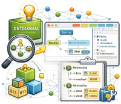
</p>

<details>
<summary>Prikaži podrobnosti</summary>

#### 4.1 Zakaj RDF sam po sebi ni dovolj?

V prejšnjem koraku smo podatke zapisali v obliki RDF in jim dodelili URI-je, s čimer smo dosegli enolično identifikacijo entitet, osnovno povezljivost in strojno berljiv ter razširljiv zapis.

Vendar nam RDF sam po sebi še ne pove:

- kaj natančno pomeni pojem `Obcina`,
- katere lastnosti smiselne,
- ali ima lahko občina več nazivov,
- ali je `steviloPrebivalcev` obvezen podatek.

Brez uporabe ontologije so ta pravila implicitna, zapisana zgolj v dokumentaciji ali v obliki tacitnega znanja razvijalcev in so nedostopna računalniški interpretaciji. Ontologija ta pravila **formalizira**, **eksplicitno opredeli** pomen pojmov, njihove lastnosti in medsebojne odnose ter jih naredi **strojno razumljive**.

#### 4.2 Kaj je ontologija (v kontekstu delavnice)?

V kontekstu delavnice je **ontologija** formalni opis pojmov, njihovih lastnosti in medsebojnih odnosov v določenem področju (npr. občine, šole).

Ontologija opredeljuje:

- kaj obstaja (tj. razredi, npr. `Obcina`, `Naselje`, `UpravnaEnota`),
- kako je opisano (tj. lastnosti, npr. `naziv`, `steviloPrebivalcev`),
- kako so pojmi povezani (tj. relacije, npr. `jeDelObcine`, `imaNaselje`),
- pravila in omejitve (npr. `Obcina` mora imeti vsaj en `naziv`).

> Ontologija ni slovar pojmov, niti podatkovna baza - je **model pomena**.

#### 4.3 Ločevanje modela in podatkov: TBox in ABox

Pri delu z ontologijami jasno ločimo dve ravni:

- **TBox (Terminological Box)**: opisuje **strukturo in pravila** pojmov v ontologiji (npr. `Obcina` je vrsta `AdministrativnaEnota`, `steviloPrebivalcev` je lastnost, ki se nanaša na `Obcina`),
- **ABox (Assertional Box)**: vsebuje **konkretne podatke** oz. **primerke** in njihove lastnosti (npr. `obcina:ajdovscina` je primerek `Obcina`, `obcina:ajdovscina` ima `steviloPrebivalcev` `19895`).

Takšno ločevanje je pomembno, ker omogoča ponovno uporabo istega modela, loči domensko znanje od podatkov in olajša vzdrževanje in nadgradnje.

#### 4.4 Uvoz podatkov TTL v orodje za upravljanje ontologij

V tem koraku se še ne bomo ukvarjali z ontologijo, ampak bo začeli z **realnimi podatki SURS**, ki smo jih v predhodnjem koraku pretvorili iz CSV v RDF/TTL.

Trenutna datoteka vsebuje:

- posamezne občine kot entitete RDF,
- osnovne lastnosti (npr. naziv, število prebivalce, SURS ID),
- vendar **še nima formalnega modela** (TBox).

Uporabili bomo orodje [Protégé](https://protege.stanford.edu/), ki je odprtokodno orodje za urejanje ontologij in RDF podatkov.

Zahtevali (`File` &rarr; `Open`) bomo datoteko [`SURS_obcine.ttl`](./assets/data/processed/SURS_obcine.ttl), ki predstavlja razširitev našega predhodnjega primera z vsemi občinami, ki so na voljo v izvorni SURS-ovi datoteki [`data.tsv`](./assets/data/raw/SURS/data.tsv).

<p align="center">
  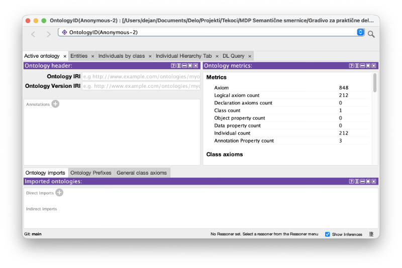
</p>

Na začetnem zaslonu na zgornji sliki opazimo povzetek vsebine naših podatkov, kjer mogoče izpostavimo nekaj ključnih informacij:

- **število trditev** _(angl. Axiom)_ je **848**, kar predstavlja število aksiomov, ki jih Protégé interpretira iz datoteke, pri čistem zapisu RDF to pogosto sovpada s trojčki (`212` občin × `4` trditve na občino = `848`),
- **število primerkov** _(angl. Individual count)_ je **212**, kar ustreza številu občin v Sloveniji (glede na podatke SURS za leto 2025),
- **število lastnosti** _(angl. Annotation Property count)_ je **3**, kar ustreza lastnostim (`idObcinaSurs`, `naziv`, `steviloPrebivalcev`), ki jih je Protégé tako interpretiral, ker še niso formalno opredeljene kot podatkovne lastnosti.

Po uvozu v Protégé lahko v zavihku `Individuals` (`Entities` &rarr; `Individuals`) pregledamo podatke, kjer vidimo seznam vseh občin in njihove lastnosti. Če izberemo posamezen primerek (npr. `ajdovscina`) lahko vidimo njegove lastnosti in vrednosti.

<p align="center">
  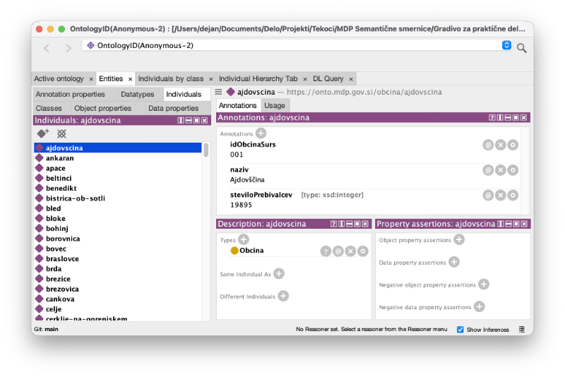
</p>

V zavihku `Classes` (`Entities` &rarr; `Classes`) pa vidimo, da imamo opredeljen zgolj RDF razred `Obcina`, ki je uporabljen v našem primeru, ni pa dodatno opisan. Prisoten je zgolj seznam primerkov tega razreda.

<p align="center">
  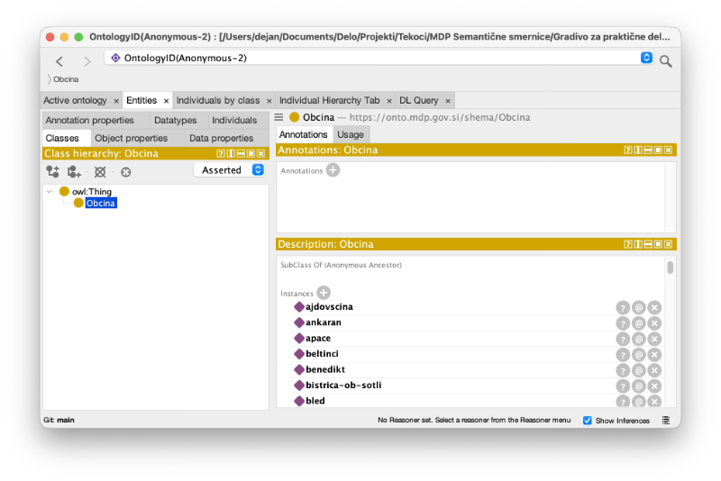
</p>

> To je tipično začetno stanje, kjer imamo **podatke (ABox)**, vendar še **nismo definirali modela (TBox)** oz. je le-ta zelo osnoven. V naslednjem koraku bomo začeli z gradnjo ontologije, ki bo formalizirala pomen naših podatkov.

#### 4.5 Prvi korak formalizacije: opis razreda

Naslednji korak je, da iz obstoječih podatkov SURS **izluščimo pojme**, ki jih implicitno že uporabljamo.

Pri tem ugotovimo, da opisujemo **občine**, ki so opisane s SURS-ovim ID-jem, imenom in številom prebivalcev za določeno leto.

To vodi do prvega osnovnega razreda `Obcina`, ki pa je implicitno že opredeljen, saj vsi naši primerki pripadajo temu razredu, kot to prikazuje naslednji primer.

```turtle
obcina:ajdovscina a shema:Obcina .
```

> V Protégé je privzeto prikazano lokalno ime `Obcina`, v ozadju pa gre za URI `shema:Obcina`.

Sedaj bomo ta nov razred `Obcina` formalno definirali v našem modelu, in sicer lahko dodamo naslednje trditve in ponovno naložimo datoteko v Protégé:

```turtle
@prefix owl:   <http://www.w3.org/2002/07/owl#> .

shema:Obcina a owl:Class ;
  rdfs:label "Občina"@sl ;
  rdfs:label "Municipality"@en .
```

<p align="center">
  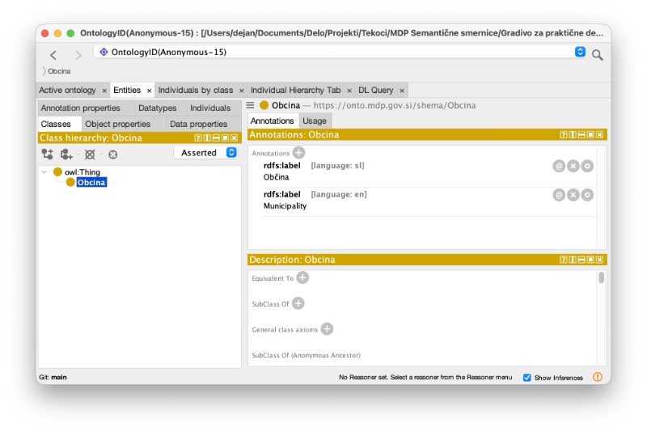
</p>

Lahko pa s klikom na `+` pri `Annotations` novo oznako dodamo tudi ročno, kjer najprej izberemo `rdfs:label`, v polje `Value` pa vnesemo oznako razreda v španskem jeziku (npr. `Municipio`) in jo označimo z jezikovno oznako `@es`, kot prikazuje spodnja slika.

<p align="center">
  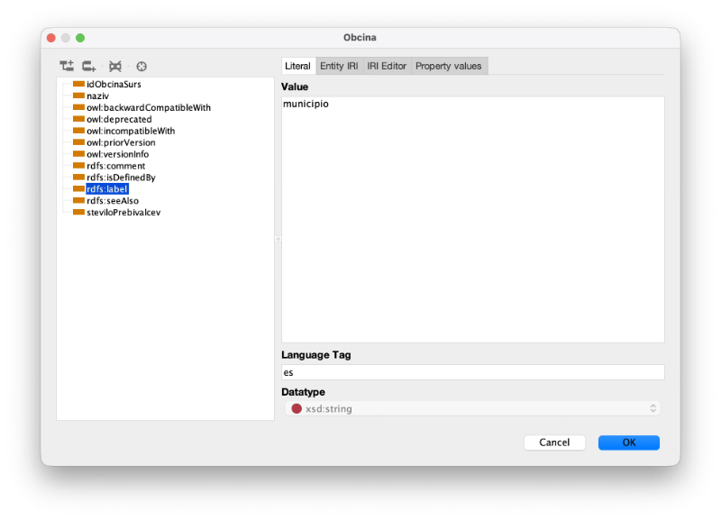
</p>

Posledično se v izvorni kodi TTL doda naslednja trditev za `shema:Obcina`:

```turtle
shema:Obcina rdf:type owl:Class ;
             rdfs:label "Municipality"@en ,
                        "Občina"@sl ,
                        "Municipio"@es .
```

> Za lastnost smo uporabili [`rdfs:label`](https://www.w3.org/TR/rdf-schema/#ch_label) kot standardno lastnost za opisovanje oznak pojmov, ki je del [RDF Schema (RDFS)](https://www.w3.org/TR/rdf-schema/).

Ko ontologijo shranimo z orodjem Protégé, pa opazimo, da je prisotnih nekaj dodatnih trditev, ki jih Protégé samodejno doda za boljšo interoperabilnost in skladnost z OWL standardom.

To je npr. opredelitev lastnosti (ki jih še nismo formalno definirali, ampak so implicitno prisotne v naših podatkih):

```turtle
shema:idObcinaSurs rdf:type owl:AnnotationProperty .
shema:naziv rdf:type owl:AnnotationProperty .
shema:steviloPrebivalcev rdf:type owl:AnnotationProperty .
```

> Ker lastnosti v začetnem SURS TTL niso formalno opredeljene, jih Protégé interpretira kot **oznake** (annotations) in jih zato označi kot `owl:AnnotationProperty`. V naslednjem koraku bomo te lastnosti formalno definirali kot **podatkovne lastnosti** (data properties) z uporabo `owl:DatatypeProperty`, kar bo omogočilo boljšo interpretacijo in uporabo teh lastnosti v našem modelu.

Prav tako vsakemu primerku (občini) doda trditev, da je [`owl:NamedIndividual`](https://www.w3.org/TR/owl2-syntax/#Named_Individuals), kar pomeni, da gre za konkretno entiteto, ki je del naše ontologije:

```turtle
obcina:ajdovscina rdf:type owl:NamedIndividual ,
                           shema:Obcina ;
                  shema:idObcinaSurs "001" ;
                  shema:naziv "Ajdovščina" ;
                  shema:steviloPrebivalcev 19895 .
```

Prav tako se opredeli osnovni prostor imen z uporabo `@base` in aktivno ontologijo, kar omogoča krajši zapis URI-jev v datoteki.

```turtle
@base <https://onto.mdp.gov.si/shema/> .
<https://onto.mdp.gov.si/shema/> a owl:Ontology .
```

#### 4.6 Podatkovne lastnosti

Naslednji korak je formalizacija lastnosti, ki jih podatki SURS že vsebujejo.

Iz vsebine lahko razberemo naslednje lastnosti:

- enolični identifikator občine po SURS-u,
- ime občine in
- število prebivalcev občine.

V grafičnem vmesniku Protégé (`Entities` &rarr; `Data properties` &rarr; `Create a new Data property`) lahko te lastnosti dodamo kot **podatkovne lastnosti** _(angl. Data Properties)_, ker se nanašajo na vrednosti, ki so literali (npr. besedilo, število).

Podatkovni lastnosti `idObcinaSurs` določimo naslednje atribute:

- ime _(angl. Name)_: `idObcinaSurs`,
- domena _(angl. Domain)_: `Obcina`,
- obseg _(angl. Range)_: `xsd:string`,
- oznake _(angl. Annotation)_: `SURS ID občine`@sl.

Posledično se v izvorni kodi TTL dodajo naslednje trditve:

```turtle
shema:idObcinaSurs a owl:DatatypeProperty ;
                   rdfs:domain shema:Obcina ;
                   rdfs:range xsd:string ;
                   rdfs:label "SURS ID občine"@sl .
```

Podobno dodajmo še lastnosti `naziv` in `steviloPrebivalcev` z ustreznimi atributi, pri čemer `steviloPrebivalcev` določimo kot `xsd:integer`, saj gre za številsko vrednost.

```turtle
shema:naziv a owl:DatatypeProperty ;
            rdfs:domain shema:Obcina ;
            rdfs:range xsd:string ;
            rdfs:label "naziv"@sl .

shema:steviloPrebivalcev a owl:DatatypeProperty ;
                         rdfs:domain shema:Obcina ;
                         rdfs:range xsd:integer ;
                         rdfs:label "število prebivalcev"@sl .
```

Ob ponovnem nalaganju datoteke v Protégé lahko sedaj v zavihku `Data properties` vidimo naše formalno definirane lastnosti z njihovimi atributi.

<p align="center">
  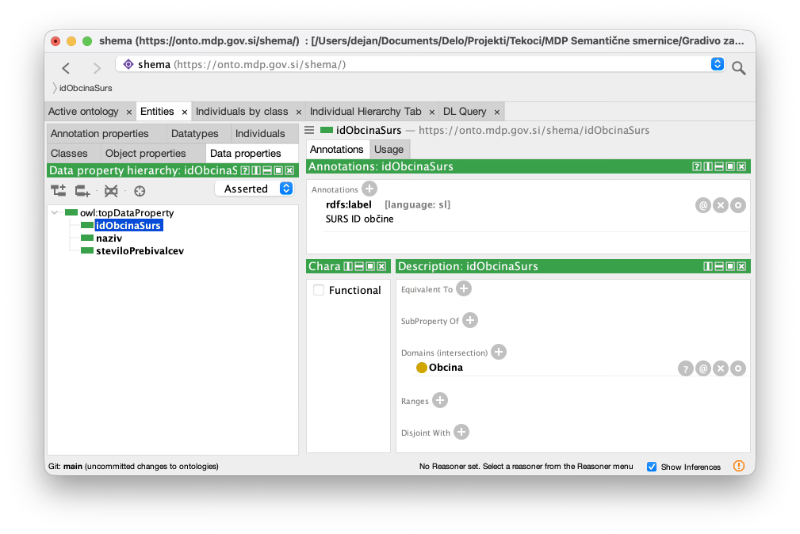
</p>

Izvorna koda primera do tega trenutka je na voljo v [`SURS_obcine_dp.ttl`](./assets/data/processed/SURS_obcine_dp.ttl), kjer so dodane formalne definicije razreda `Obcina` in podatkovnih lastnosti `idObcinaSurs`, `naziv` in `steviloPrebivalcev`.

#### 4.7 Nadgradnja z objektnimi lastnostmi

Pri podatkih, ki jih trenutno imamo na voljo, je zagotovo na mestu vprašanje - kako bi vključili še zgodovinske podatke ali podatke za naslednja leta.

Namesto da ima občina `steviloPrebivalcev` kot enostavno številsko vrednost, bi lahko imeli **povezavo na drug primerek**, ki predstavlja **meritev števila prebivalcev za določeno leto**.

> To je tipičen primer, kjer se izkaže grafovska struktura v primerjavi s tabelarično. Atribut `steviloPrebivalcev` v resnici ni lastnost občine, ampak lastnost opazovanja občine skozi leta. Zato vrednost modeliramo ločeno, da lahko imamo več meritev za različna leta, ne da bi morali spreminjati strukturo razreda `Obcina`.

Vpeljali bi lahko razred `MeritevPrebivalcev`, ki bi imel lastnosti `leto` in `vrednost`, ter nato v razred `Obcina` dodali **objektno lastnost** _(angl. Object Property)_ `imaMeritevPrebivalcev`, ki bi kazala na primerek `MeritevPrebivalcev`.

Najprej dodajmo razred `MeritevPrebivalcev` in nove lastnosti, povezane z njim. Atribut `leto` določimo kot `xsd:gYear`, saj gre za letnico, medtem ko `vrednost` ostane `xsd:integer`.

```turtle
shema:MeritevPrebivalcev a owl:Class ;
                          rdfs:label "Meritev števila prebivalcev"@sl .

shema:leto a owl:DatatypeProperty ;
            rdfs:domain shema:MeritevPrebivalcev ;
            rdfs:range xsd:gYear ;
            rdfs:label "leto"@sl .

shema:vrednost a owl:DatatypeProperty ;
                rdfs:domain shema:MeritevPrebivalcev ;
                rdfs:range xsd:integer ;
                rdfs:label "vrednost"@sl .
```

Posledično lahko obstoječo podatkovno lastnost `steviloPrebivalcev` nadomestimo z novo objektno lastnostjo `imaMeritevPrebivalcev`, ki bo kazala na primerek `MeritevPrebivalcev`.

> V nadaljevanju `shema:steviloPrebivalcev` ne uporabljamo več neposredno kot lastnost razreda `Obcina`, ampak vrednost hranimo prek meritev; lastnost lahko zato odstranimo.

```turtle
shema:imaMeritevPrebivalcev a owl:ObjectProperty ;
                             rdfs:domain shema:Obcina ;
                             rdfs:range shema:MeritevPrebivalcev ;
                             rdfs:label "ima meritev števila prebivalcev"@sl .
```

<p align="center">
  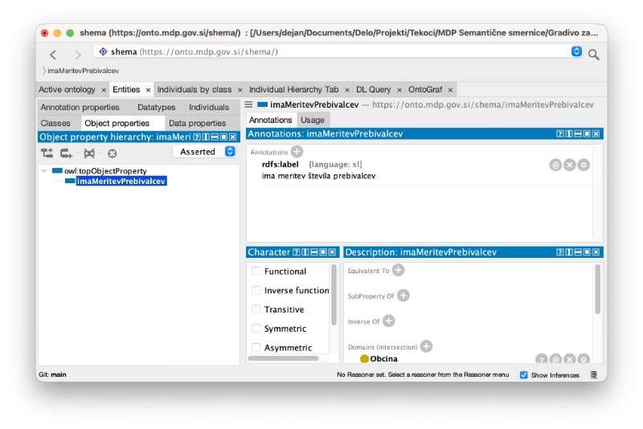
</p>

#### 4.8 Preoblikovanje podatkov z novo strukturo

Podatke (tj. primerki) o številu prebivalcev iz SURSA bomo sedaj preoblikovali tako, da namesto neposredne vrednosti `steviloPrebivalcev` vsebujejo povezavo na primerek `MeritevPrebivalcev`, ki ima lastnosti `leto` in `vrednost`. To nam omogoča, da imamo več meritev za različna leta, ne da bi morali spreminjati strukturo razreda `Obcina`.

Za občino `Ajdovščina` to izgleda takole:

```turtle
obcina:ajdovscina a shema:Obcina ;
    shema:idObcinaSurs "001" ;
    shema:naziv "Ajdovščina" ;
    shema:imaMeritevPrebivalcev obcina:ajdovscina-stevilo-prebivalcev-2024, obcina:ajdovscina-stevilo-prebivalcev-2025 .

obcina:ajdovscina-stevilo-prebivalcev-2024 a shema:MeritevPrebivalcev ;
    shema:leto "2024"^^xsd:gYear ;
    shema:vrednost 19891 .

obcina:ajdovscina-stevilo-prebivalcev-2025 a shema:MeritevPrebivalcev ;
    shema:leto "2025"^^xsd:gYear ;
    shema:vrednost 19895 .
```

Celotna datoteka z nadgrajenim modelom in preoblikovanimi podatki je na voljo v [`SURS_obcine_dp_op.ttl`](./assets/data/processed/SURS_obcine_dp_op.ttl).

</details>

### 5. Raven 5 ★: povezani podatki in zunanji viri

<p align="left">
  
</p>

<details>
<summary>Prikaži podrobnosti</summary>

#### 5.1 Kaj pomeni raven 5 ★ v praksi?

Na ravni 4 ★ smo podatke zapisali v RDF, dodali enolične URI-je, formalizirali model z ontologijo (formalni model TBox in strukturirane primerke ABox) in dosegli strojno razumljivost. Vendar so naši podatki še vedno **izolirani** - niso povezani z drugimi viri, ne uporabljajo skupnih pojmov ali standardov, in niso del širšega ekosistema podatkov.

Raven 5 ★ dosežemo šele, ko naše podatke **povežemo z drugimi viri** in **uporabimo skupne pojme** iz obstoječih ontologij, s čimer postanejo del globalnega spletnega ekosistema podatkov.

Ključna razlika je:

> 4 ★ = podatki so **semantično opisani**  
> 5 ★ = podatki so semantično opisani in **povezani z drugimi podatki**

#### 5.2 Zunanji viri za povezovanje

- **Repozitorij podatkovnih modelov** (npr. Centralni besednjak) na Platformi za semantično interoperabilnost.
- **Splošne terminološke (TBox) ontologije** (npr. [Schema.org](https://schema.org/), [FOAF](http://xmlns.com/foaf/spec/), [Dublin Core](http://purl.org/dc/elements/1.1/)), [SKOS](http://www.w3.org/2004/02/skos/core#), [DCAT](http://www.w3.org/ns/dcat#) idr.
- **Splošne podatkovne (ABox) ontologije** (npr. [DBpedia](https://wiki.dbpedia.org/), [Wikidata](https://www.wikidata.org/), [LinkedGeoData](http://linkedgeodata.org/)) idr.
- **Domenski besednjaki** (npr. [EUROVOC](https://eurovoc.europa.eu/), [GEMET](https://www.eionet.europa.eu/gemet/)), [INSPIRE](https://inspire.ec.europa.eu/glossary), [GeoNames](https://www.geonames.org/) idr.

> Povezovanje z zunanjimi viri ne pomeni, da bomo vse podatke fizično uvozili v lastno podatkovno zbirko. Ključna ideja povezanih podatkov je, da **ohranimo podatke pri izvoru**, mi pa zagotovimo **enolične povezave**, prek katerih lahko po potrebi dostopamo po dodatnih informacijah.

V nadaljevanju se ne bomo osredotočili na množično povezovanje z zunanjimi viri, ampak bomo najprej pogledali **povezovanje znotraj javnega sektorja**, in sicer na primeru [`CRP.ttl`](./assets/data/processed/CRP.ttl), ki predstavlja referenčne, produkcijsko usmerjen model. Na njem bomo pokazali osnovne semantične mehanizme povezovanja, ki so uporabni pri povezovanju z zunanjimi viri.

#### 5.3 Povezovanje s hierarhijo pojmov (`rdfs:subClassOf`)

V ontologiji CRP so pojmi organizirani v **hierarhijo razredov**, kar omogoča ponovno uporabo lastnosti in bolj splošne poizvedbe. V zvihku `Entities` &rarr; `Classes` lahko opazimo hierarhijo (glej spodnjo sliko), kjer so razredi organizirani z uporabo lastnosti `rdfs:subClassOf`, kar pomeni, da je en razred podrazred drugega.

- `cnbs:Sifrant`
  - `:SifrantIO`
    - `:Obcina`

<p align="center">
  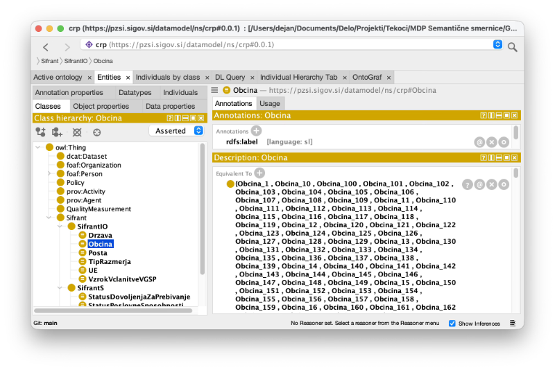
</p>

Zapis hierarhije v RDF/TTL je naslednji:

```turtle
@prefix : <https://pzsi.sigov.si/datamodel/ns/crp#> .
@prefix cnbs: <http://onto.mju.gov.si/centralni-besednjak-sifranti#> .

cnbs:Sifrant rdf:type owl:Class .

:SifrantIO rdf:type owl:Class ;
           rdfs:subClassOf cnbs:Sifrant .

:Obcina rdf:type owl:Class ;
        rdfs:subClassOf :SifrantIO .
```

S tem formalno opredelimo, da je vsaka `Obcina` tudi `SifrantIO` in vsak `SifrantIO` tudi `cnbs:Sifrant`.

Pri tem smo načrtno uporabili pojme iz **Centralnega besednjaka** (npr. `cnbs:Sifrant`), ki je del Platforme za semantično interoperabilnost, da pokažemo, kako lahko uporabimo skupne pojme za povezovanje z zunanjimi viri. S tem smo dosegli, da so naši podatki o občinah del širšega ekosistema podatkov, ki uporablja skupne standarde in pojme.

> To predstavlja temelj za sklepanje: če poizvedujemo po vseh `cnbs:Sifrant`, bomo samodejno dobili tudi `:Obcina`, če seveda uporabljamo mehanizme sklepanja, ki upoštevajo hierarhijo razredov.

#### 5.4 Povezovanje s hierarhijo lastnosti (`rdfs:subPropertyOf`)

Podoben koncept kot pri razredih velja tudi za lastnosti. V CRP-ju se pogosto pojavi situacija, kjer imamo splošno lastnost (npr. identifikator) in nato bolj specifične lastnosti, ki so podlastnosti te splošne lastnosti (npr. identifikator v določenem registru).

V zavihku `Entities` &rarr; `Data properties` lahko opazimo hierarhijo lastnosti (glej spodnjo sliko), kjer so določene lastnosti označene kot `rdfs:subPropertyOf` drugih lastnosti.

- [`foaf:givenName`](https://xmlns.com/foaf/spec/#term_givenName)
  - `:ime`
    - `:mat_ime_1`

<p align="center">
  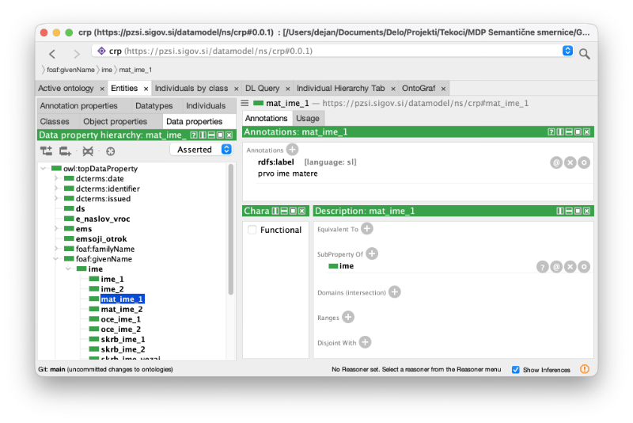
</p>

Zapis hierarhije v RDF/TTL je naslednji:

```turtle
@prefix : <https://pzsi.sigov.si/datamodel/ns/crp#> .
@prefix cnb: <http://onto.mju.gov.si/centralni-besednjak-core#> .
@prefix foaf: <http://xmlns.com/foaf/0.1/> .

:ime rdf:type owl:DatatypeProperty ;
     rdfs:subPropertyOf foaf:givenName ;
     rdfs:domain cnb:FizicnaOseba ;
     rdfs:range [ rdf:type rdfs:Datatype ;
                  owl:onDatatype xsd:string ;
                  owl:withRestrictions ( [ xsd:maxLength "35"^^xsd:nonNegativeInteger
                                         ]
                                       )
                ] ;
     rdfs:label "ime"@sl .

:mat_ime_1 rdf:type owl:DatatypeProperty ;
           rdfs:subPropertyOf :ime ;
           rdfs:label "prvo ime matere"@sl .
```

S tem formalno opredelimo, da je `:mat_ime_1` podlastnost `:ime`, ki je podlastnost `foaf:givenName`. To pomeni, da če imamo trditev, da ima neka oseba `:mat_ime_1` vrednost "Marija", lahko sklepamo, da ima ta oseba tudi `:ime` "Marija" in `foaf:givenName` "Marija", če uporabljamo mehanizme sklepanja, ki upoštevajo hierarhijo lastnosti. Prav tako se deduje tudi vse omejitve, npr. dolžina 35 znakov, ki je opredeljena na `:ime`, velja tudi za `:mat_ime_1`.

#### 5.5 Povezovanje istih primerkov (`owl:sameAs`)

V nekaterih primerih vemo, da dva URI-ja predstavljata **popolnoma isto entiteto**, le v različnih podatkovnih virih.

V našem primeru občina Ajdovščina v viru CRP (`:Obcina_1`) predstavlja isto občino, ki je opredeljena tudi na Wikidata (`wd:Q331701`).

<p align="center">
  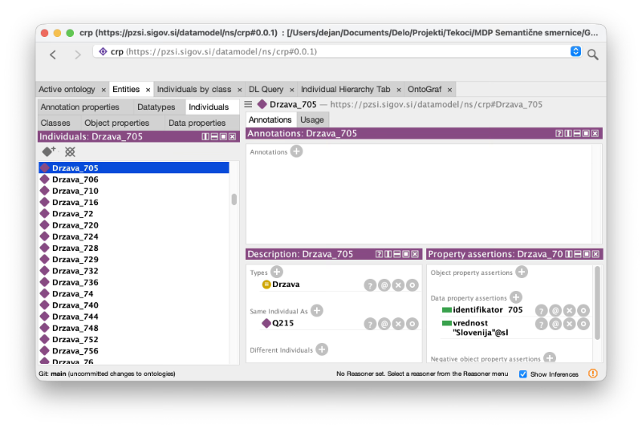
</p>

Zapis hierarhije v RDF/TTL je naslednji:

```turtle
@prefix : <https://pzsi.sigov.si/datamodel/ns/crp#> .
@prefix wd: <https://www.wikidata.org/entity/> .

:Obcina_1 rdf:type owl:NamedIndividual ,
                   :Obcina ;
          :identifikator 1 ;
          :vrednost "Ajdovščina"@sl ;
          owl:sameAs wd:Q331701 .
```

Semantični pomen tega zapisa je močan, in sicer: vse, kar velja za `:wd:Q331701` (npr. da je to občina, da ima določene lastnosti, da je del Slovenije), velja tudi za `:Obcina_1`, in obratno. To nam omogoča, da združimo informacije iz različnih virov, ne da bi morali fizično združiti podatke, ampak preprosto zagotovimo povezavo med njimi.

#### 5.6 Povezovanje pojmov (`owl:equivalentClass`)

V predhodnjih korakih smo povezovali **primerke** (`owl:sameAs`) in gradili **hierarhije** razredov (`rdfs:subClassOf`) oz. lastnosti (`rdfs:subPropertyOf`). Pogosto pa želimo povezati tudi **pojme** oz. razrede, npr. v našem primeru pojem **občine** pomeni isto kot pojem **municipality** v nekem drugem slovarju ali ontologiji. Za to lahko uporabimo gradnik `owl:equivalentClass`.

V CRP-ju je razred `:Obcina` zapisan kot definiran razred, in sicer z natančnim opisom, kaj vse ga opredeljuje. To je razvidno v naslednjem zapisu in pogledu v orodju Protégé, in sicer v dveh delih:

- Zaprt nabor primerkov z `owl:equivalentClass` in `owl:oneOf`, kjer so navedeni vsi primerki, ki spadajo v razred `:Obcina` (npr. `:Obcina_1`, `:Obcina_10`, `:Obcina_100` itd.).
- Omejitev pri dedovanju z `rdfs:subClassOf`, kjer ima `:identifikator` omejitev vrednosti med 1 in 999, `:vrednost` pa omejitev dolžine do 35 znakov.

```turtle
:Obcina rdf:type owl:Class ;
        owl:equivalentClass [ rdf:type owl:Class ;
                              owl:oneOf ( :Obcina_1
                                          :Obcina_10
                                          :Obcina_100
                                          ...
                                        )
                            ] ;
        rdfs:subClassOf :SifrantIO ,
                        [ rdf:type owl:Restriction ;
                          owl:onProperty :identifikator ;
                          owl:allValuesFrom [ rdf:type rdfs:Datatype ;
                                              owl:onDatatype xsd:int ;
                                              owl:withRestrictions ( [ xsd:minInclusive 1
                                                                     ]
                                                                     [ xsd:maxInclusive 999
                                                                     ]
                                                                   )
                                            ]
                        ] ,
                        [ rdf:type owl:Restriction ;
                          owl:onProperty :vrednost ;
                          owl:allValuesFrom [ rdf:type rdfs:Datatype ;
                                              owl:onDatatype xsd:string ;
                                              owl:withRestrictions ( [ xsd:maxLength "35"^^xsd:nonNegativeInteger
                                                                     ]
                                                                   )
                                            ]
                        ] ;
        rdfs:label "Občina"@sl .
```

<p align="center">
  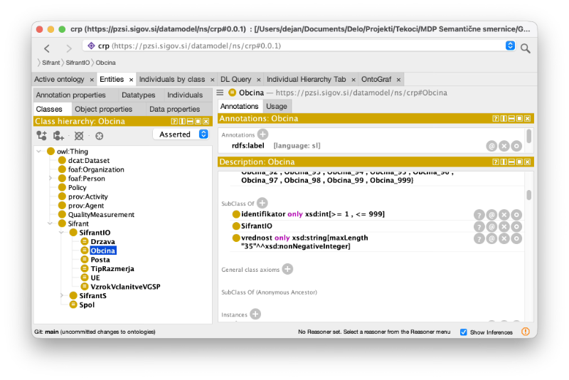
</p>

Takšen pristop je uporaben za **šifrante**, kjer želimo izrecno opredeliti, da gre za končen seznam.

#### 5.7 Povezovanje CRP in SURS podatkov

Sedaj si poglejmo konkreten primer povezovanja podatkov dveh virov:

- Centralnega registra prebivalcev (**CRP**) in
- Statističnega urada RS (**SURS**).

Cilj ni združevanje podatkov v eno datoteko, temveč omogočiti, da podatki iz različnih virov **opisujejo iste entitete** in jih lahko **skupaj uporabljamo v poizvedbah in sklepanju**. S tem namenom bomo integracijo opredelili v novi datoteki [`Integracija_CRP_SURS.ttl`](./assets/data/processed/Integracija_CRP_SURS.ttl), kjer bomo vzpostavili povezave med pojmi in primerki iz obeh virov.

CRP in SURS obravnavata **iste občine**, vendar z različnim namenom: v CRP-ju so uradni šifranti in stabilni identifikatorji, ne vsebuje pa statističnih kazalnikov (npr. števila prebivalcev), ki pa so prisotni v SURS-u.

Najbolj neposreden način povezovanja je na ravni **primerkov občin**, kjer lahko uporabimo `owl:sameAs`.

V CRP imamo npr.

```turtle
@prefix : <https://pzsi.sigov.si/datamodel/ns/crp#> .

:Obcina_1 rdf:type owl:NamedIndividual ,
                   :Obcina ;
          :identifikator 1 ;
          :vrednost "Ajdovščina"@sl .
```

V SURS-u pa imamo npr.

```turtle
@prefix shema: <https://onto.mdp.gov.si/shema/> .
@prefix obcina: <https://onto.mdp.gov.si/obcina/> .

obcina:ajdovscina a shema:Obcina ;
    shema:idObcinaSurs "001" ;
    shema:naziv "Ajdovščina" .
```

Ker vemo, da oba primerka predstavljata **isto realno občino**, ju lahko povežemo:

```turtle
@prefix crp: <https://pzsi.sigov.si/datamodel/ns/crp#> .
@prefix sursABox: <https://onto.mdp.gov.si/obcina/> .

crp:Obcina_1 owl:sameAs sursABox:ajdovscina .
```

> Zaradi lažjega razumevanje in interpretacijo uporabimo predponi `crp` in `surs` za URI-je iz obeh virov.

S tem povemo, da gre za isto entiteto, lastnosti iz obeh virov veljajo za isto občino, poizvedbe lahko "prehajajo" med viroma. Ključno je, da **podatkov ne podvajamo**, ampak jih **logično združimo**.

Poleg primerkov lahko povežemo tudi **pojme**. Npr. v CRP-ju imamo razred:

```turtle
@prefix : <https://pzsi.sigov.si/datamodel/ns/crp#> .

:Obcina rdf:type owl:Class .
```

V SURS modelu pa:

```turtle
@prefix shema: <https://onto.mdp.gov.si/shema/> .
@prefix obcina: <https://onto.mdp.gov.si/obcina/> .

obcina:ajdovscina a shema:Obcina .
```

Če se odločimo, da oba pojma pomenita isto stvar (tj. občino), lahko uporabimo `owl:equivalentClass`. Posledica tega bi bila, da bi vsi primerki `:Obcina` v CRP-ju postali tudi `shema:Obcina` in obratno, kar omogoča skupno interpretacijo in uporabo lastnosti, ki so opredeljene na obeh straneh. Če pa želimo biti bolj previdni (npr. ker SURS model vključuje tudi zgodovinske oz. agregirane enote), lahko uporabimo šibkejšo povezavo `rdfs:subClassOf`.

```turtle
@prefix crp: <https://pzsi.sigov.si/datamodel/ns/crp#> .
@prefix sursTBox: <https://onto.mdp.gov.si/shema/> .

sursTBox:Obcina rdfs:subClassOf crp:Obcina .
```

V okviru integracije za občino Ajdovščina že imamo povezavo na Wikidata (`owl:sameAs wd:Q331701`), kar pomeni, da je ta občina del širšega ekosistema podatkov, ki vključuje tudi SURS in CRP, saj so ti povezani z Wikidata. Dodajmo še omenjene povezave za nekaj drugih občin.

```turtle
@prefix crp: <https://pzsi.sigov.si/datamodel/ns/crp#> .
@prefix sursTBox: <https://onto.mdp.gov.si/shema/> .
@prefix sursABox: <https://onto.mdp.gov.si/obcina/> .
@prefix wd: <https://www.wikidata.org/entity/> .

sursTBox:Obcina rdfs:subClassOf crp:Obcina .

crp:Obcina_1 owl:sameAs sursABox:ajdovscina .
crp:Obcina_11 owl:sameAs sursABox:celje .
crp:Obcina_61 owl:sameAs sursABox:ljubljana .
crp:Obcina_70 owl:sameAs sursABox:maribor .

crp:Obcina_1 owl:sameAs wd:Q331701 .
crp:Obcina_11 owl:sameAs wd:Q3441823 .
crp:Obcina_61 owl:sameAs wd:Q3434113 .
crp:Obcina_70 owl:sameAs wd:Q3435104 .
```

</details>

### 6. Uporaba semantično opisanih podatkov s SPARQL

<p align="left">
  
</p>

<details>
<summary>Prikaži podrobnosti</summary>

#### 6.1 Poizvedovanje nad semantično opisanimi podatki - SPARQL
Do sedaj smo spoznali osnovne koncepte za zapisovanje semantičnih podatkov. Podatki so sicer pomembni, vendar ena izmed ključnih lastnosti, ki jo potrebujemo za delo, je rokovanje s podatki - iskanje, dodajanje novih podatkov, posodabljanje obstoječih in brisanje.

v tem razdelku bomo prikazali uporabo poizvedovalnega jezika in protokola **SPARQL** za delo s semantičnimi podatki. SPARQL je rekurzivna kratica za *SPARQL Protocol and RDF Query Language.* Poleg poizvedovalnega jezika definira tudi protokol s pravili za povezovanje odjemalskega programa na SPARQL vmesnik in izmenjavo podatkov preko HTTP.

[SPARQL 1.0](https://www.w3.org/TR/rdf-sparql-query/) je bil kot uraden standard W3C objavljen v letu 2008, zadnja [verzija 1.1](https://www.w3.org/TR/sparql11-overview/) pa v letu 2013. Posodobljena verzija vsebuje tudi dodatne funkcionalnosti, kot je uporaba podpoizvedb, negacije, posodobitve grafa in iskanje preko poti lastnosti v grafih.

<p align="center">
  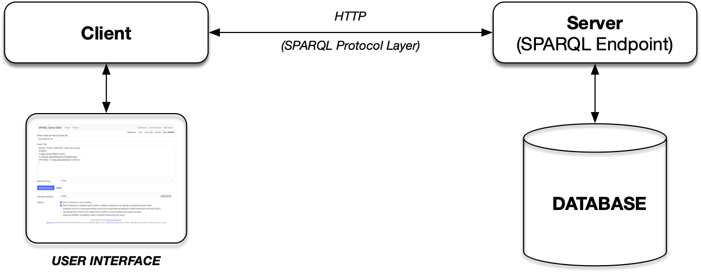
</p>

#### 6.2 Uporaba podatkov CRP za iskanje
SPARQL bomo lažje razumeli, če si bomo podatke predstavljali **v obliki grafa**. *Trojčki*, ki smo jih do sedaj zapisovali v datotekak *TTL* namreč tvorijo strukturo grafa. Naslednji zapis

```turtle
###  https://pzsi.sigov.si/datamodel/ns/crp#obc
:obc rdf:type owl:ObjectProperty ;
     rdfs:domain cnb:FizicnaOseba ;
     rdfs:range :Obcina .
```

si lahko v obliki grafa predstavljamo sledeče:

<p align="center">
  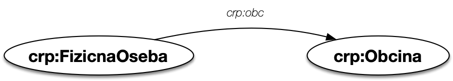
</p>

Če si predstavljamo še okolico teh konceptov, lahko ugotovimo, da bi graf izgledal nekako takole:

<p align="center">
  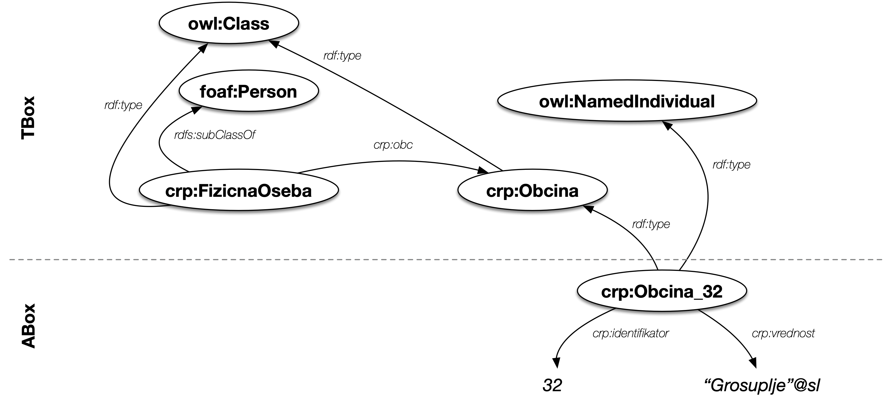
</p>

Okolje Protégé ponuja tudi možnost poizvedovanja s SPARQL. V Protégé odprimo datoteko [`CRP.ttl`](./assets/data/processed/CRP.ttl) ter aktivirajmo zavihek za poizvedovanje s SPARQL (*Window -> Tabs -> SPARQL Query*).

Izvedimo naslednjo poizvedbo: 

```SPARQL
SELECT ?osebek ?povedek ?predmet

WHERE { 
    ?osebek ?povedek ?predmet . 
}
```

Rezultat poizvedbe so vsi *trojčki*, ki se nahajajo v naši ontologiji.

<p align="center">
  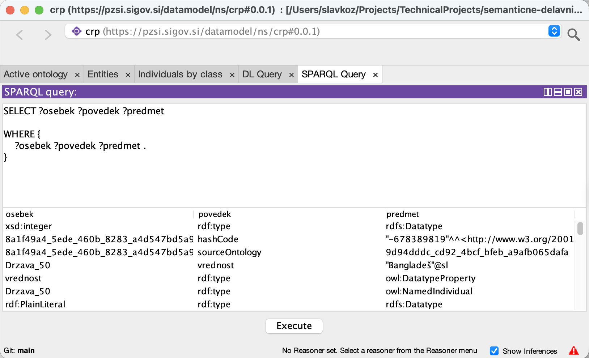
</p>

#### 6.3 Osnovno iskanje vsebine v CRP
V naši poizvedbi termini, ki se začnejo z `?` predstavljajo spremenljivke. SPARQL poskuša najti vse podgrafe v našem grafu (t.j. podatkovni bazi) in izpiše vsa ujemanja podgrafa s celotnim grafom. 

Tako lahko npr. poiščemo vse povezave, ki izhajajo iz objekta `crp:Obcina_32`:

```SPARQL
SELECT ?povedek ?predmet

WHERE { 
    <https://pzsi.sigov.si/datamodel/ns/crp#Obcina_32> ?povedek ?predmet . 
}
```

Pri daljših poveizvedbah lahko nekatere naslovne prostore uporabljamo večkrat, zato si lahko pripravimo okrajšave tudi v primeru poizvedb:

```SPARQL
PREFIX crp: <https://pzsi.sigov.si/datamodel/ns/crp#>

SELECT ?povedek ?predmet

WHERE { 
    crp:Obcina_32 ?povedek ?predmet . 
}
```

Rezultat zgornjih poizvedb, ki predstavlja vse povezane povedke in predmete z objektom `crp:Obcina_32` so prikazani na naslednji sliki:

<p align="center">
  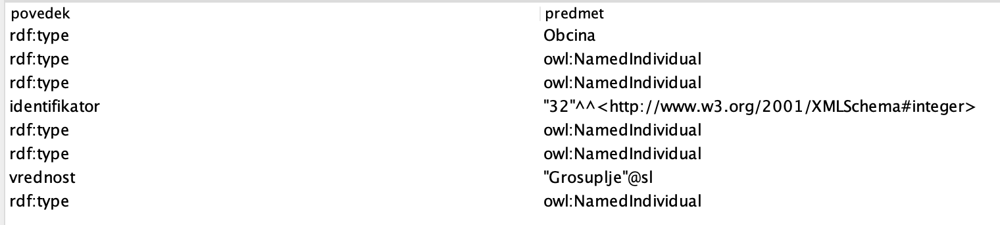
</p>

#### 6.4 Osnovni koncepti SPARQL 
Za prikaz osnovnih konceptov SPARQL si bomo izposodili javen primer iz DBPedije.

DBPedija je javna semantična baza, ki vsebuje znanje iz Wikipedije. Vsebino črpa predvsem iz okenc tipa *infobox* na wiki straneh. Kot primer vzemimo https://en.wikipedia.org/wiki/Audi. Vsebine iz strukturirane desne strani so zapisane tudi na DBPediji: https://dbpedia.org/page/Audi. Spletna stran na DBPediji je prikaz semantično opisanega vira za objekt *Audi*. Kot uporabniku nam je omogočeno, da podatke prikažemo tudi v drugačni obliki - na primer takšni, kot smo semantično objekte opisovali zgoraj, v formatu *Turtle*.

<p align="center">
  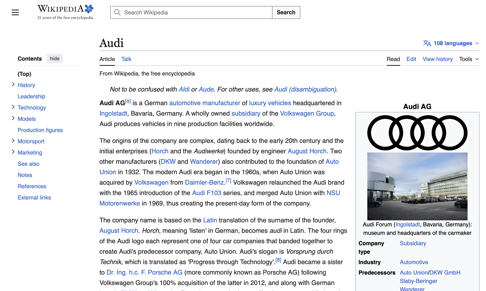
</p>

Na DBPediji lahko razberemo grafovsko strukturo zapisov, ki v našem primeru izgleda približno sledeče:

<p align="center">
  
</p>

Izluščili smo manjši del grafa znanja iz DBpedije. Na Wikipediji lahko preberemo, da je August Horch leta 1910 ustanovil avtomobilsko podjetje Audi. V grafu vidimo tri entitete oziroma primerke: August Horch, Audi in Nemčija. Vsak primerek je semantično opisan in določen z več lastnostmi. Te lastnosti določajo vrednosti ali povezave do drugih primerkov. Opazimo, da je podjetje Audi ustanovil August Horch, ki je tipa oseba (*dbo:Person*). Primerek Audi vsebuje ime "Audi AG", je tipa podjetje (dbo:Company), ustanovljeno je bilo leta 1910 in se nahaja v Nemčiji.

Celoten graf je sestavljen iz trojčkov: osebek, povedek in predmet. Na primer: trojica dbr:August_Horch, dbp:name in vrednost »August Horch«. Druga trojica je dbr:Audi, dbo:founded_by in dbr:August_Horch. Na ta način lahko zgradimo poljuben graf.

DBPedija nudi javno storitev za izvajanje poizvedb (angl. SPARQL endpoint), ki je dostopna na povezavi https://dbpedia.org/sparql in nam omogoča neposredno izvajanje poizvedb SPARQL.

<p align="center">
  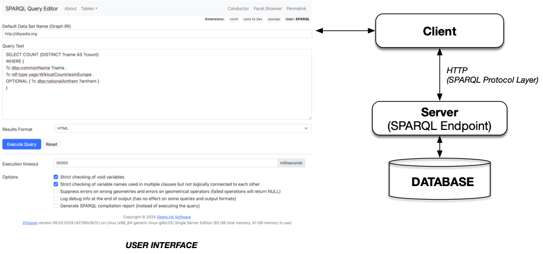
</p>

##### Poizvedbe SPARQL
Kot smo ugotovili prej, SPARQL omogoča definiranje trojic, ki se morajo ujemati z vzorci trojic v grafu.

Za pridobitev rezultatov moramo definirati spremenljivke, ki se vežejo na koncepte RDF. V nadaljnjih primerih bomo dodali tudi pogoje in preddefinirane vrednosti, da pridobimo točno želene rezultate.

Najprej si oglejmo najpreprostejšo poizvedbo: `SELECT ?subject ?predicate ?object`. Ta poizvedba vrne vrednosti za definirane spremenljivke. V našem primeru vrne vse trojice v grafu znanja. Naš primer vsebuje 9 trojic.

> Odvisno od implementacije SPARQL poizvedovalnega vmesnika se lahko zgodi, da tako enostavna poizvedba ne bo delovala in boste morali vnesi še stavek WHERE z navedenimi temi tremi spremenljivkami.

Če poznate relacijske baze podatkov in jezik SQL, boste opazili podobna načela, ki se uporabljajo pri jeziku SPARQL.

##### Ujemanje vzorcev
Grafni vzorec SPARQL (angl., graph pattern) je trojica RDF, zapisana v serializaciji Turtle, ki lahko na mestu osebka, povedka ali predmeta vsebuje spremenljivke.

Če želimo na primer poiskati vsa imena v naši podatkovni bazi, oblikujemo pogoj kot trojico, v kateri je osebek povezan s predmetom prek lastnosti `dbp:name`. Ker so vzorci zapisani v formatu Turtle, jih zaključimo s piko.

V našem primeru izvlečka iz podatkovne baze rezultat vsebuje dve vrstici oziroma dve možni ujemanji grafa – to sta imeni *Augusta Horcha* in podjetja *Audi*. Rezultat lahko preverimo na spodnji sliki, kjer vidimo, da sta oba ujemajoča se objekta povezana s svojo vrednostjo imena preko lastnosti `dbp:name`.

<p align="center">
  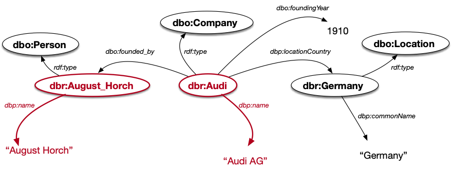
</p>

##### Konjunkcija posameznih vzorcev
Nadalje lahko grafne vzorce kombiniramo in tako oblikujemo bolj kompleksne poizvedbe. V tem primeru želimo poiskati imena in leta ustanovitve vseh podjetij v naši podatkovni bazi:

```SPARQL
?subject dbp:name ?name .
?subject rdf:type dbo:Company .
?subject dbo:foundingYear ?foundingYear .
```

V naši bazi imamo le eno podjetje, in sicer *Audi AG*.

<p align="center">
  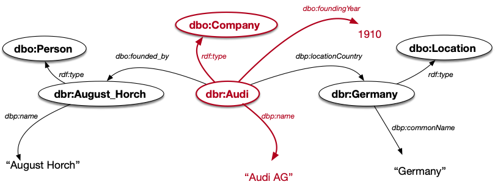
</p>

V zgornjem vzorcu se spremenljivka `?subject` nanaša na isti osnovni objekt, pri čemer morajo biti vsi trije stavki konjunktivnega vzorca izpolnjeni. Zaradi tega bodo med rezultate vključeni vsi objekti, ki imajo hkrati lastnosti `dbp:name` in `dbo:foundingYear` ter so tipa `dbo:Company`.

Poizvedbi bi lahko dodali še več stavkov in jo tako naredili še kompleksnejšo.

##### Poizvedba SPARQL
Sedaj oblikujmo svojo prvo poizvedbo SPARQL. Spodaj je celotna poizvedba SPARQL, ki vsebuje enake grafne vzorce kot smo jih predstavili predhodno.

```SPARQL
PREFIX rdf: <http://www.w3.org/1999/02/22-rdf-syntax-ns#>
PREFIX dbp: <http://dbpedia.org/property/>
PREFIX dbo: <http://dbpedia.org/ontology/>

SELECT ?name ?foundingYear

FROM <http://dbpedia.org/>

WHERE {
  ?subject dbp:name ?name .
  ?subject rdf:type dbo:Company .
  ?subject dbo:foundingYear ?foundingYear .
}
```

Prvi del poizvedbe vsebuje predpone (angl., prefixes), s katerimi poizvedbo skrajšamo in naredimo bolj berljivo. Definirali smo okrajšave za tri imenske prostore (angl., namespaces), ki jih uporabljamo. Sintaksa za določanje predpon se začne s ključno besedo **PREFIX**, ki ji sledi naziv okrajšave in dvopičje. Vrednost polnega URI-ja vira zapišemo med levi in desni oglat oklepaj `<...>`. Nato lahkko v poizvedbi nameso zapisovanja celotnih URI-jev uporabljamo te okrajšave.

Naslednji del je stavek **SELECT**, kjer določimo želen rezultat – torej spremenljivke, ki jih želimo pridobiti iz podatkovne baze in jih vrniti kot rezultat.

V delu **FROM** določimo graf, iz katerega želimo pridobiti rezultate.

V delu **WHERE** navedemo vse pogoje oziroma grafne vzorce, ki morajo veljati za vsak rezultat.

##### ORDER BY, LIMIT
Naš prikazan primer grafa znanja na sliki zgoraj je majhen podnabor precej večjega grafa znanja iz DBPedije. DBPedijina storitev SPARQL je javno dostopna in jo lahko vsak prosto uporablja. DBPedia je sicer eden največjih javno dostopnih grafov znanja in vsebuje približno 900 milijonov dejstev s podatki za okoli 400.000 organizacij.

Izvedite zgornjo poizvedbo na naslednji storitvi https://dbpedia.org/sparql. Kakšne rezultate dobite? So pričakovani?

Vrne se mnogo rezultatov. Naša poizvedba namreč išče vzorce, ki se ujemajo z grafom na desni strani. Ta graf predstavlja splošno podjetje, za katerega nas zanima ime in leto ustanovitve. Ker je v DBPediji približno 400.000 organizacij, se s poizvedbo ujema veliko podjetij – in vsa se tudi vrnejo med rezultate.

Rezultate lahko poskusimo urediti in omejiti število ujemajočih se rezultatov, da lažje najdemo zapise za Audi. Poskusimo rezultate urediti po imenu podjetja in preverimo samo prvih 100 rezultatov. Poizvedbi zato dodami naslednji vrstici:

```SPARQL
ORDER BY ASC (?name)
LIMIT 100
```

Ko pogledamo rezultate, vidimo, da imajo nekatera podjetja na začetku prazna imena ali pa je njihovo ime leksikografsko precej pred pričakovanim imenom Audi.

##### OFFSET
Če na primer preskočimo prvih 14800 rezultatov, se bo podjetje Audi AG pojavilo med naslednjimi 100 zadetki (stanje 11. februarja 2026). Upoštevajte, da je DBPedia živa podatkovna baza, zato se lahko ta odmik razlikuje, ko boste poizvedbo izvedli sami. Zgornji poizvedbi dodajte še naslednjo vrstico:

```SPARQL
OFFSET 14800
```

Opazimo lahko tudi, da so v DBPedii za Audi AG shranjena različna leta ustanovitve, pri čemer se prvo začne z letom 1909.

##### FILTER
Boljša možnost za pridobitev želenih rezultatov je uporaba filtriranja. V našem primeru poznamo točen primerek podjetja, ki ga iščemo - `dbr:Audi` (http://dbpedia.org/resource/Audi), zato lahko uporabimo omejitev **FILTER** in vrnemo vse rezultate, kjer je osebek tipa `dbr:Audi`. V poizvedbi med pogoji dodamo še naslednji pogoj (ostale omejitve lahko odstranimo):

```SPARQL
FILTER (?subject IN (dbr:Audi))
```

Druga možnost je, da namesto spremenljivke za osebek neposredno zapišemo grafne vzorce z `dbr:Audi`.

##### FILTER REGEX
V splošnem natančnih identifikatorjev (URI-jev) želenih objektov. Ti so pogosto namenjeni organizaciji podatkov v bazi in so lahko tudi prazni ali si jih je težko zapomniti. Zato lahko filtriramo tudi na podlagi regularnih izrazov. Zgornji filter zamenjamo s sledečim:

```SPARQL
FILTER REGEX (?name, "^audi", "i")
```

V tem primeru filtriramo rezultate po imenu z uporabo regularnega izraza. Izraz vrne vsa imena, ki se začnejo z "audi", ne glede na velikost črk. Zato lahko besedo *audi* zapišemo z malimi črkami. To omogoča zastavica za neobčutljivost na velikost črk (angl., insensitive flag) kot zadnji parameter funkcije FILTER. Seveda lahko uporabimo katerokoli drugo standardno sintakso regularnih izrazov.

##### OPTIONAL
Če preverite definicijo vira [Company](https://dbpedia.org/ontology/Company) v DBPediji, lahko ugotovite, da definira tudi lastnost z imenom `dbo:tradingName`. Dodajmo jo torej v našo poizvedbo, da za Audi pridobimo še to lastnost in preverimo rezultate. K pogoju dodamo naslednje:

```SPARQL
?subject dbo:tradingName ?tradingName .
```

Rezultat poizvedbe je prazen. Po dodatnem preverjanju lahko ugotovimo, da objekt `dbr:Audi` te lastnosti ne vsebuje. Ker v grafu znanja za ta primerek takšna lastnost ne obstaja, se vzorec ne more ujemati in zato se kot rezultat ne vrne nič.

Za rešitev problema moramo uporabiti ključno besedo **OPTIONAL**. Če se pri poizvedbi obvezni del vzorca ujema, se rezultat vrne in se opcijski del doda k rezultatu, če obstaja. Če ne obstaja, je opcijski del prazen, vendar se ostali ujemajoči deli poizvedbe vseeno vrnejo. Zgornji pogoj tako spremenite sledeče:

```SPARQL
OPTIONAL {?subject dbo:tradingName ?tradingName .}
```

##### UNION
Zdaj se vprašajmo, koliko avtomobilskih proizvajalcev je v Nemčiji.

Ko preverimo vnos za Audi v DBPedijii (https://dbpedia.org/page/Audi), ugotovimo, da obstaja lastnost `dbr:industry`, ki opredeljuje avtomobilsko industrijo. Opazimo tudi lastnost `dbp:locationCountry`, ki določa državo. Zato definiramo vzorec, s katerim takšna podjetja izpišemo in prikažemo njihove oznake:

```SPARQL
?carCompany rdfs:label ?carCompanyName .
?carCompany dbo:industry dbr:Automotive_industry .
?carCompany dbp:locationCountry dbr:Germany . 
```

Takoj opazimo, da rezultat vsebuje ponavljajoče se odgovore – imena podjetij v različnih jezikih. Zato dodamo dodatno omejitev **FILTER**, ki izpis omeji le na imena podjetij v angleščini.

```SPARQL
FILTER (LANG(?carCompanyName)="en")
```

Tako kot rezultat dobimo 9 imen podjetij.

Ker poizvedujemo po privzetem grafu DBPedije, lahko del **FROM** izpustimo in bo poizvedba na endpointu še vedno delovala ter vrnila enake rezultate.

Vemo, da Nemčija ni edina država, ki proizvaja avtomobile, zato želimo izpisati avtomobilska podjetja, ki se nahajajo v Nemčiji ali v Sloveniji.

SPARQL podpira logično disjunkcijo z uporabo ključne besede **UNION**. V tem primeru najprej definiramo splošni del grafnega vzorca, nato pa v oklepajih navedemo dve možni alternativi, povezani z **UNION**.

```SPARQL
{ ?carCompany dbp:locationCountry dbr:Germany . }
    UNION
{ ?carCompany dbp:locationCountry dbr:Slovenia . }
```

Poizvedba sedaj definira, da mora obstajati instanca, ki ima določeno oznako (`rdfs:label`), ima lastnost `dbo:industry` tipa `dbr:Automotive_industry` in ima lastnost lokacije (`dbp:locationCountry`), kjer je lokacija lahko bodisi Nemčija (`dbr:Germany`) bodisi Slovenija (`dbr:Slovenia`).

Ko poizvedbo izvedemo, ugotovimo, da v Sloveniji obstaja le še eno dodatno avtomobilsko podjetje z angleškim imenom.

Zdaj bodimo bolj splošni in poskusimo poiskati vsa avtomobilska podjetja ter njihove pripadajoče države.

Prejšnjo poizvedbo zato preoblikujemo tako, da uvedemo dodatno spremenljivko za državo in njeno oznako, ki se vrne v rezultatu. Prav tako razširimo omejitev **FILTER**, da se obe oznaki izpišeta v angleščini:

```SPARQL
PREFIX rdf: <http://www.w3.org/1999/02/22-rdf-syntax-ns#>
PREFIX dbp: <http://dbpedia.org/property/>
PREFIX dbo: <http://dbpedia.org/ontology/>

SELECT ?carCompanyName ?countryName

WHERE {
    ?carCompany rdfs:label ?carCompanyName .
    ?carCompany dbo:industry dbr:Automotive_industry .
    ?carCompany dbp:locationCountry ?country .
    ?country rdfs:label ?countryName . 
    FILTER (LANG(?carCompanyName)="en" AND
            LANG(?countryName)="en")
}
```

Rezultat vsebuje precejšnje število držav.

##### Agregatne funkcije in grupiranje
Zdaj pa ugotovimo, koliko avtomobilskih podjetij je v prejšnjem rezultatu.

SPARQL podpira agregatne funkcije, ki jih lahko vključimo v del **SELECT** poizvedbe. **COUNT** je ena izmed agregatnih funkcij, ki prešteje, kolikokrat je določen izraz vezan (angl., bound). V našem primeru štejemo število imen avtomobilskih podjetij in stolpec v rezultatni tabeli poimenujemo kot **?carCompanyNameCount**:

```SPARQL
SELECT (COUNT(?carCompanyName) AS ?carCompanyNameCount)
```

Rezultat te poizvedbe vrne 318 avtomobilskih podjetij, ki se ujemajo z danim grafnim vzorcem v DBPedijii.

Druge agregatne funkcije, ki jih lahko uporabimo, so na primer **SUM**, **AVG**, **MIN**, **MAX** ali **SAMPLE**.

Ob podrobnejšem pregledu opazimo, da so nekatera podjetja očitno povezana z več državami, zato so v štetje vključena večkrat. Če želimo šteti samo različna imena podjetij, moramo uporabiti ključno besedo **DISTINCT**:

```SPARQL
SELECT (COUNT(DISTINCT ?carCompanyName) AS ?carCompanyNameCount)
```

Zdaj je vsako ime podjetja prešteto samo enkrat, rezultat pa pove, da je takih podjetij 310.

Takšen rezultat pa nam še ne pove ničesar o številu avtomobilskih podjetij po državah. Da dobimo število avtomobilskih podjetij po državah, želimo rešitev razdeliti v skupine – tj. države – in znotraj teh skupin prešteti podjetja. To lahko dosežemo z določilom **GROUP BY**. V delu *GROUP BY* navedemo spremenljivke, po katerih se bodo rezultati grupirali. Nato lahko uporabimo agregatne funkcije, kot je **COUNT**, za izračune znotraj posamezne skupine. V našem primeru smo rezultate dodatno uredili padajoče glede na število avtomobilskih podjetij v državi. Na koncu zgornje poizvedbe dodamo še stavka: 

```SPARQL
GROUP BY ?countryName
ORDER BY DESC (?carCompanyNameCount)
```

Ko poizvedbo izvedemo, ugotovimo, da je največ avtomobilskih podjetij registriranih v Združenih državah Amerike, sledita pa Kitajska. Da dejansko ugotovimo imena podjetij v teh skupinah, lahko uporabimo drugo agregatno funkcijo, imenovano **GROUP_CONCAT**. **GROUP_CONCAT** uporabi vse vrednosti iz skupine in jih združi v en niz. V našem primeru smo uporabili spremenljivko **?carCompanyName**, da izpišemo imena avtomobilskih podjetij v posamezni državi in jih ločimo z vejico. Rezultat zdaj vsebuje tudi seznam imen podjetij po državah: 

```SPARQL
SELECT ?countryName (COUNT(DISTINCT ?carCompanyName) AS ?carCompanyNameCount) (GROUP_CONCAT(?carCompanyName) as ?carCompanyNames)
```

Včasih želimo rezultate filtrirati na podlagi agregatnih funkcij po skupinah. V tem primeru moramo omejitve zapisati v del **HAVING** poizvedbe. Na primer: če želimo izpisati samo države, ki imajo več kot 5 imen avtomobilskih podjetij, moramo za delom **GROUP BY** dodati ustrezno omejitev v bloku **HAVING**. Po izvedbi poizvedbe opazimo, da rezultat vsebuje 13 držav, ki vključujejo večino danes dobro znanih avtomobilskih proizvajalcev.

Naša končna poizvedba izgleda sledeče:

```SPARQL
PREFIX rdf: <http://www.w3.org/1999/02/22-rdf-syntax-ns#>
PREFIX dbp: <http://dbpedia.org/property/>
PREFIX dbo: <http://dbpedia.org/ontology/>

SELECT ?countryName (COUNT(DISTINCT ?carCompanyName) AS ?carCompanyNameCount) (GROUP_CONCAT(?carCompanyName) as ?carCompanyNames)

WHERE {
    ?carCompany rdfs:label ?carCompanyName .
    ?carCompany dbo:industry dbr:Automotive_industry .
    ?carCompany dbp:locationCountry ?country .
    ?country rdfs:label ?countryName . 
    FILTER (LANG(?carCompanyName)="en" AND 
            LANG(?countryName)="en")
}
GROUP BY ?countryName
HAVING (COUNT(?carCompanyName) > 5)
ORDER BY DESC (?carCompanyNameCount)
```

##### Napredne funkcionalnosti
Prikazali smo različne načine uporabe jezika SPARQL za poizvedovanje nad RDF podatki.

SPARQL 1.1 vključuje širši nabor funkcionalnosti, kot smo jih obravnavali v tem razdelku. Poleg stavka **SELECT** vsebuje tudi ukaze, kot je **CONSTRUCT**, ki generira RDF podatke v skladu z grafno predlogo. **INSERT DATA** omogoča vstavljanje novih trojic v graf. Ukaz **ASK** preveri, ali je poizvedbeni vzorec rešljiv, ne da bi dejansko vrnil rezultate. **DESCRIBE** pa omogoča vpogled v RDF podatke, povezane z določenim virom. Tako kot smo na spletni strani DBPedie preverili lastnosti vira *Audi*, nam lahko stavek **DESCRIBE** posreduje podobne informacije.

Znotraj SPARQL stavkov lahko uporabljamo tudi vgnezdene poizvedbe. V eni sami poizvedbi lahko izvajamo federirano iskanje prek več SPARQL endpointov (**SERVICE**). Povezave (**BIND**) omogočajo spreminjanje oziroma ustvarjanje vrednosti, s katerimi operiramo. Napredne funkcionalnosti, kot so poti lastnosti (angl., property paths), nam omogočajo izvajanje kompleksnih sprehodov po grafu in iskanj.

Pri nadaljnjem delu boste morda naleteli na **SHACL** (angl., Shapes Constraint Language), ki je standard W3C za validacijo vsebine podatkovne baze v obliki RDF grafa. S SHACL lahko definirate omejitve za podatke, ki jih shranjujete v RDF grafu, nato pa preverite skladnost grafa s temi omejitvami.

#### 6.5 Poizvedovanje s SPARQL preko programskih vmesnikov 
Poizvedovalni jezik SPARQL je možno uporabljati tudi neposredno preko programskih knjižnic, podobno kot SQL pri dostopu do podatkov pri relacijskih podatkovnih bazah.

Na povezavi [SPARQL in Python](./assets/SPARQL_in_Python.ipynb) se nahaja Jupyter delovni zvezek, ki ga lahko preskusite na lokalnem računalniku ali v okviru storitve [Google Colab](http://colab.google.com/).

Delovni zvezek prikazuje primer programske uporabe javnih storitev SPARQL.


#### 6.6 Uporaba lastne baze z vmesnikom SPARQL 
Semantične (RDF) podatke lahko hranimo v namenskih podatkovnih bazah, ki tudi podpirajo poizvedovanje s SPARQL. Primeri takšnih baz so [Amazon Neptune](https://aws.amazon.com/neptune/), [Oracle Graph Database](https://www.oracle.com/database/integrated-graph-database/), [Apache Jena Fuseki](https://jena.apache.org/documentation/fuseki2/index.html), [GraphDB](https://graphdb.ontotext.com/), ...

V našem primeru bomo uporabili **GraphDB**. Bazo bomo zagnali v okolju *Docker* sledeče:

> `docker run -p 127.0.0.1:7200:7200 --name graphdb-instance-name-11 -t ontotext/graphdb:11.2.1`

Ko se baza vzpostavi, lahko do nje dostopate preko spletnega vmesnika na naslovu http://localhost:7200. 
Za uporabo brezplačne verzije potrebujete licenco, ki jo lahko pridobite na spletni strani https://www.ontotext.com/products/graphdb. 

<p align="center">
  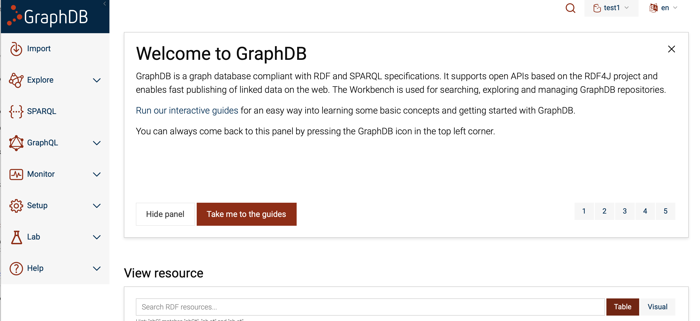
</p>

Če nato bazo ugasnemo in želimo isti vsebnik ponovno zagnati, uporabimo ukaz:

> `docker start graphdb-instance-name-11`

V podatkovni bazi morate najprej ustvariti nov *GraphDB Repository.* Pri tem v razdelku *Inference and Validation* odznačite opcijo **Disable owl:sameAs** in pustite izbran način sklepanja **RDFS-Plus (Optimized)**.

<p align="center">
  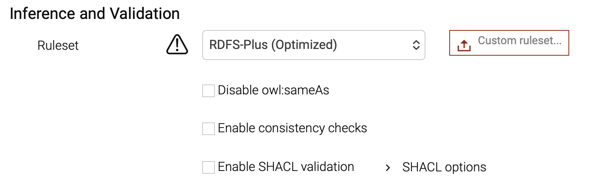
</p>

V meniju "Import" nato izberite vaš repozitorij ter naložite datoteki [CRP.ttl](./assets/data/processed/CRP.ttl) in [SURS_obcine_dp_op.ttl](./assets/data/processed/SURS_obcine_dp_op.ttl). 

<p align="center">
  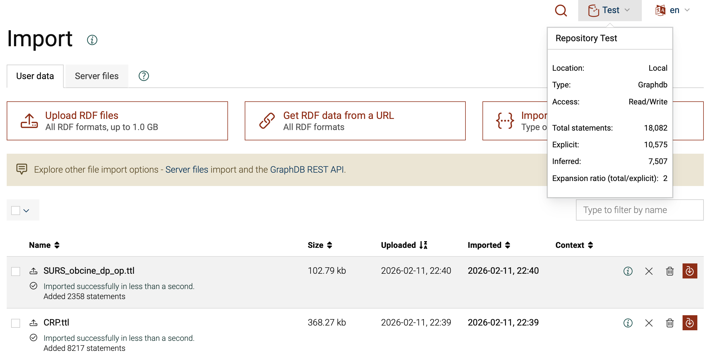
</p>

Opazimo lahko, da je bilo uvoženih 10575 trojčkov. Poleg teh pa je bilo zaradi pravil sklepanja dodatno dodanih še 7507 trojčkov (več o tem v naslednjem poglavju).

V zavihku SPARQL poskusimo izvesti poizvedbo, ki smo jo na začetku poglavja izvedli v Protégé:

```SPARQL
PREFIX crp: <https://pzsi.sigov.si/datamodel/ns/crp#>

SELECT ?povedek ?predmet

WHERE { 
    crp:Obcina_32 ?povedek ?predmet . 
}
```

Opazimo, da kot rezultat dobimo ustrezne rezultate iz registra CRP.


#### 6.7 Federirane poizvedbe SPARQL preko več grafov 
V prejšnjih razdelkih smo uporabljali tudi javno storitev SPARQL DBPedija. S pomočjo ukaza **SERVICE** lahko poizvedujemo tudi po grafih, ki so shranjeni v drugih bazah in dostopni preko storitve SPARQL. Poskusimo izvesti SPARQL poizvedbo na naši bazi GraphDB in hkrati pridobiti podatke iz DBPedije. Uporabimo primer za podjetje *Audi* in izpišimo ime podjetja in leto ustanovitve:

```SPARQL
PREFIX rdf: <http://www.w3.org/1999/02/22-rdf-syntax-ns#>
PREFIX dbo: <http://dbpedia.org/ontology/>
PREFIX dbr: <http://dbpedia.org/resource/>
PREFIX dbp: <http://dbpedia.org/property/>

SELECT ?subject ?name ?foundingYear

WHERE {
      SERVICE <https://dbpedia.org/sparql> {
        ?subject dbp:name ?name .
        ?subject rdf:type dbo:Company .
        ?subject dbo:foundingYear ?foundingYear .
        FILTER (?subject IN (dbr:Audi))
      }
}
```

Opazimo lahko, da so bili podatki iz DBPedije ustrezno pridobljeni.

V našem registru CRP imamo shranjena le imena in identifikatorje občin. Poskusimo za občino Grosuplje poleg identifikatorja izpisati še ime župana. Na DBPediji opazimo, da ima Grosuplje svoj zapis - https://dbpedia.org/page/Grosuplje. 

```SPARQL
PREFIX rdf: <http://www.w3.org/1999/02/22-rdf-syntax-ns#>
PREFIX crp: <https://pzsi.sigov.si/datamodel/ns/crp#>
PREFIX dbp: <http://dbpedia.org/property/>

SELECT ?idObcine ?zupan

WHERE { 
    SERVICE <https://dbpedia.org/sparql> {
      ?subject dbp:officialName "Grosuplje"@en .
      ?subject dbp:leaderName ?zupan .
    }
    ?obcina rdf:type crp:Obcina .
    ?obcina crp:identifikator ?idObcine . 
    ?obcina crp:vrednost "Grosuplje"@sl .
}
```

Zgornji rezultat nam vrne identifikator 32 in ime župana - Peter Verlič.

</details>

### 7. Sklepanje: prehod od podatkov k znanju

<p align="left">
  
</p>

<details>
<summary>Prikaži podrobnosti</summary>

#### 7.1 Uporaba več podatkovnih virov in materializacija - SURS in CRP 
V predhodnem poglavju smo v našo bazo že uvozili datoteki [CRP.ttl](./assets/data/processed/CRP.ttl) in [SURS_obcine_dp_op.ttl](./assets/data/processed/SURS_obcine_dp_op.ttl). Vira CRP in SURS nista povezana in primer podatkov izgleda sledeče:

<p align="center">
  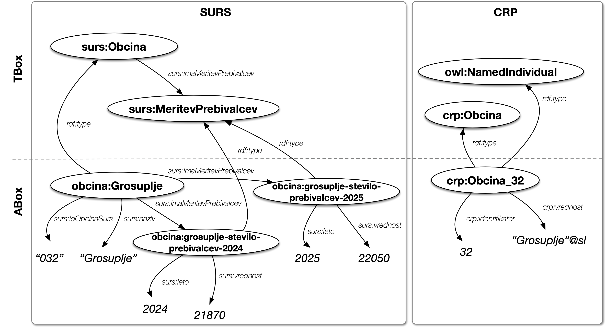
</p>

Nad podatki CRP lahko za Grosuplje izvedemo sledečo poizvedbo:

```SPARQL
PREFIX rdf: <http://www.w3.org/1999/02/22-rdf-syntax-ns#>
PREFIX crp: <https://pzsi.sigov.si/datamodel/ns/crp#> 

SELECT ?imeObcineCRP ?idCRP
WHERE {
  ?obcinaCRP crp:vrednost ?imeObcineCRP .
  ?obcinaCRP crp:identifikator ?idCRP .
  ?obcinaCRP rdf:type crp:Obcina .
  FILTER (?imeObcineCRP = "Grosuplje"@sl)
}
```

Nad podatki SURS lahko izvedemo sledečo poizvedbo:

```SPARQL
PREFIX rdf: <http://www.w3.org/1999/02/22-rdf-syntax-ns#>
PREFIX surs: <https://onto.mdp.gov.si/shema/>

SELECT ?imeObcineSURS ?idSURS ?letoMeritve ?steviloPrebivalcev
WHERE {  
  ?obcinaSURS surs:naziv ?imeObcineSURS .
  ?obcinaSURS surs:idObcinaSurs ?idSURS .
  ?obcinaSURS rdf:type surs:Obcina .
  ?obcinaSURS surs:imaMeritevPrebivalcev ?meritev .
  ?meritev surs:leto ?letoMeritve .
  ?meritev surs:vrednost ?steviloPrebivalcev .
  FILTER (?imeObcineSURS = "Grosuplje") 
}
```

Nad podatki iz obeh delov v grafu lahko sestavimo tudi skupno poizvedbo, ki izgleda sledeče:

```SPARQL
PREFIX rdf: <http://www.w3.org/1999/02/22-rdf-syntax-ns#>
PREFIX crp: <https://pzsi.sigov.si/datamodel/ns/crp#> 
PREFIX surs: <https://onto.mdp.gov.si/shema/>

SELECT ?imeObcineCRP ?idCRP ?imeObcineSURS ?idSURS ?letoMeritve ?steviloPrebivalcev
WHERE {
  ?obcinaCRP crp:vrednost ?imeObcineCRP .
  ?obcinaCRP crp:identifikator ?idCRP .
  ?obcinaCRP rdf:type crp:Obcina .
  FILTER (?imeObcineCRP = "Grosuplje"@sl)

  ?obcinaSURS surs:naziv ?imeObcineSURS .
  ?obcinaSURS surs:idObcinaSurs ?idSURS .
  ?obcinaSURS rdf:type surs:Obcina .
  ?obcinaSURS surs:imaMeritevPrebivalcev ?meritev .
  ?meritev surs:leto ?letoMeritve .
  ?meritev surs:vrednost ?steviloPrebivalcev .
  FILTER (?imeObcineSURS = "Grosuplje") 
}
```

Rezultat izgleda primeren, **vendar POZOR**! Poizvedba išče ujemanje na vzorcih na dveh nepovezanih komponentah grafa. Ker je v CRP delu grafa možna samo ena rešitev, rezultat izgleda v redu. Sicer pa takšna poizvedba predstavlja **kartezični produkt** med delom grafa CRP in SURS.

Ker vemo, da so v našem grafu nekateri koncepti enaki, vendar poimenovani drugače, moramo to eksplicitno definirati. V datoteki [Integracija_CRP_SURS_SPARQL.ttl](./assets/data/processed/Integracija_CRP_SURS_SPARQL.ttl) definiramo te enakosti s pomočjo lastnosti `owl:equivalentClass` in `owl:sameAs`. 

```SPARQL
@prefix owl: <http://www.w3.org/2002/07/owl#> .
@prefix surs: <https://onto.mdp.gov.si/shema/> .
@prefix crp: <https://pzsi.sigov.si/datamodel/ns/crp#> .

surs:Obcina owl:equivalentClass crp:Obcina .
surs:naziv owl:sameAs crp:vrednost .
```

Uvozimo sedaj še to datoteko v bazo GraphDB. Opazimo lahko, da sta bila uvožena 2 trojčka (*Explicit*), dodatno pa je bilo zgeneriranih še 1713 trojčkov (iz 7507 na 9220, *Inferred*).

<p align="center">
  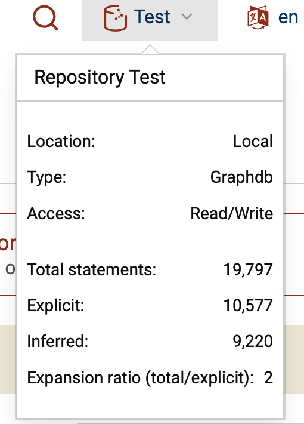
</p>

Dodatni trojčki, ki so bili zgenerirani, so posledica mehanizma sklepanja in predstavljajo materializirane povezave, ki se nato zaradi tega tudi odražajo v poizvedbah. Pri spodnji poizvedbi lahko opazimo, da sta sedaj oba tipa občin izenačena in da lahko lastnost `crp:vrednost` uporabljamo tudi nad primerki občin iz SURS.

```SPARQL
PREFIX rdf: <http://www.w3.org/1999/02/22-rdf-syntax-ns#>
PREFIX crp: <https://pzsi.sigov.si/datamodel/ns/crp#> 
PREFIX surs: <https://onto.mdp.gov.si/shema/>

SELECT * WHERE {
  ?obcina rdf:type surs:Obcina .
  ?obcina surs:naziv ?nazivSURS .
  ?obcina crp:vrednost ?nazivCRP . 
  ?obcina surs:imaMeritevPrebivalcev ?meritev .
  ?meritev surs:leto ?letoMeritve .
  ?meritev surs:vrednost ?vrednost .
}
```

</details>

### 8. Vizualizacija

<p align="left">
  
</p>

<details><summary>Prikaži podrobnosti</summary>

#### 8.1 Zakaj je vizualizacija pomembna?

Čeprav so semantično in tehnično bogati podatki ključni za interoperabilnost, morajo biti hkrati **dostopni** in **razumljivi tudi uporabnikom**, ki niso tehnično podkovani.. Zato je priporočljivo, da ob strojno berljivih oblikah (RDF, API) ponudimo tudi dopolnilne predstavitve, kot so **vizualizacije**, **interaktivne tabele** ali **povzetki v naravnem jeziku**.

V nadaljevanju si bomo ogledali:

- praktične možnosti vizualizacije v orodju **Protégé**,
- primer prototipa uporabniškega vmesnika **Podatkovnega zemljevida** (na odprtih podatkih OPSI),
- kako vizualizacija podpira razumevanje **globalne sheme**, **sheme posameznih virov** in **konkretnih podatkov**.

#### 8.2 Razširitve orodja Protégé za vizualizacijo

Protégé ima več uporabnih razširitev, ki pomagajo pri razumevanju ontologije in odnosov med pojmi:

- **OntoGraph** (glej sliko),
- OWLViz,
- ProtégéVOWL,
- SOVA.

<p align="center">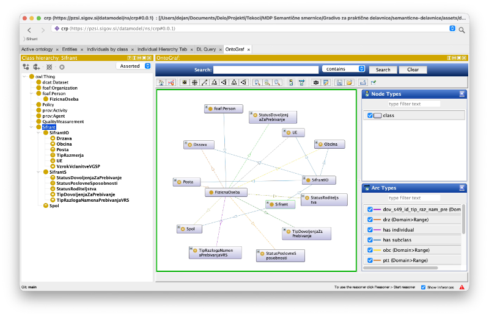 </p>

**Praktični namen**: hitro vizualno preverjanje, ali smo pojme in relacije modelirali smiselno (npr. ali so razredi pravilno povezani, ali so relacije ustrezne, ipd.).

#### 8.3 Uporabniški vmesnik Podatkovnega zemljevida

Kot primer vizualizacije in raziskovanja podatkov si ogledamo prototip pregledovalnika, ki je nastal v okviru projekta **Podatkovni zemljevid** v sodelovanju z Ministrstvom za digitalno preobrazbo (MDP).

Prototip ponuja naslednje **osrednje funkcionalnosti**:

- pregled **globalne sheme** Podatkovnega zemljevida,
- pregled **sheme** posameznega/izbranih **vira**/ov,
- predogled **podatkov** posameznega/izbranih **vira**/ov,

ter podporne funkcionalnosti:

- **večjezičnost** (sl, en),
- **iskanje** (koncepti, povezave, metapodatki),
- **skrivanje konceptov** (za fokusiran pregled),
- **fokusiranje** na izbran koncept in prikaz konteksta.

#### 8.4 Demonstracija Podatkovnega zemljevida: od globalne sheme do podatkov

V nadaljevanju si oglejmo prototip uporabniškega vmesnika Podatkovnega zemljevida. Najprej začnemo na globalnem pogledu, kjer so izpostavljeni ključni koncepti (npr. Katalog, Nabor podatkov, Distribucija, Shema) in njihove povezave.

<p align="center">
  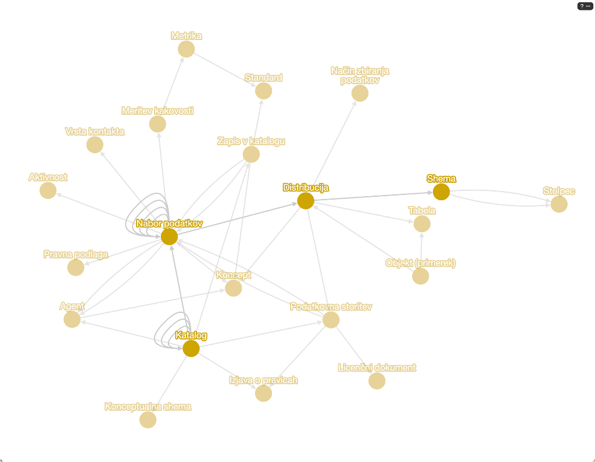
</p>

Ko se z miško premaknemo nad izbran koncept, se pogled osredotoči na njegov **kontekst sosednosti**: prikazani so le odvisni koncepti in povezave med njimi, dodatno pa se pokažejo nazivi relacij.

<p align="center">
  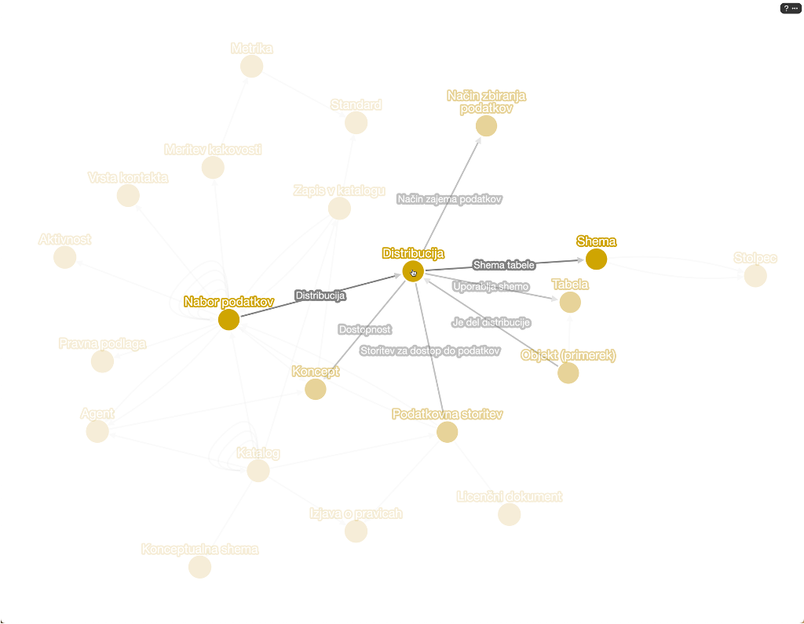
</p>

Klik na koncept odpre **podrobnosti**: URI, definicije (npr. `skos:definition`) ter rangirane lastnosti in najpomembnejše metapodatke. V praksi je to zelo uporaben način, da si hitro razložimo “kaj je kaj” brez brskanja po TTL/ontologiji.

<p align="center">
  
</p>

Vmesnik omogoča tudi razširitev prikaza, kjer po potrebi prikažemo **vse** lastnosti/metapodatke, ne le najpomembnejših.

<p align="center">
  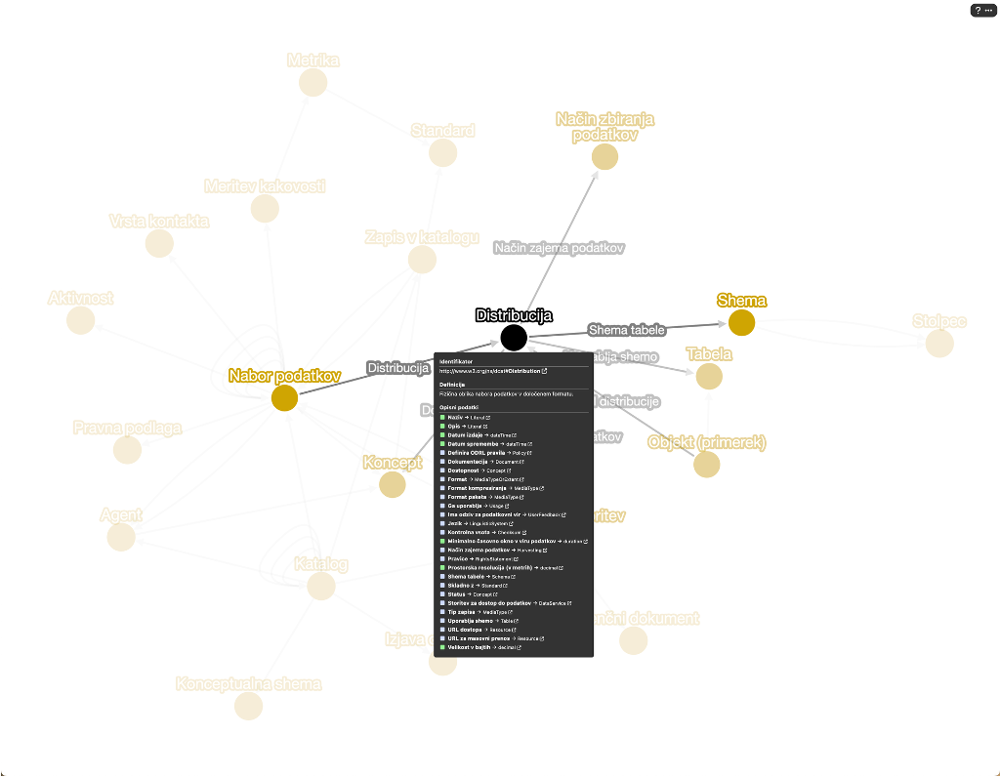
</p>

Dodatne funkcionalnosti so dostopne prek **desnega klika** na koncept (npr. fokus, skrij, podrobnosti, razišči podatke). To je priročno pri velikih shemah, kjer brez “fokusa” hitro izgubimo pregled.

<p align="center">
  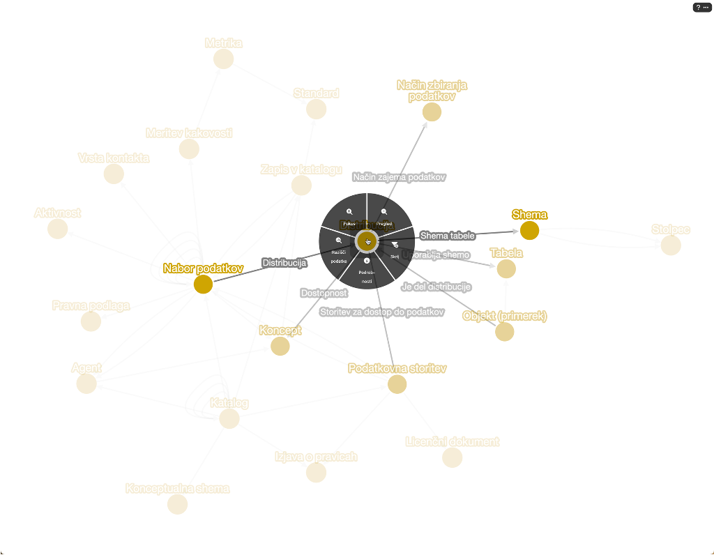
</p>

Pomembna prednost prototipa je tudi **večjezičnost**: tako uporabniški vmesnik kot metapodatki (nazivi pojmov in lastnosti) so lahko prikazani v različnih jezikih.

<p align="center">
  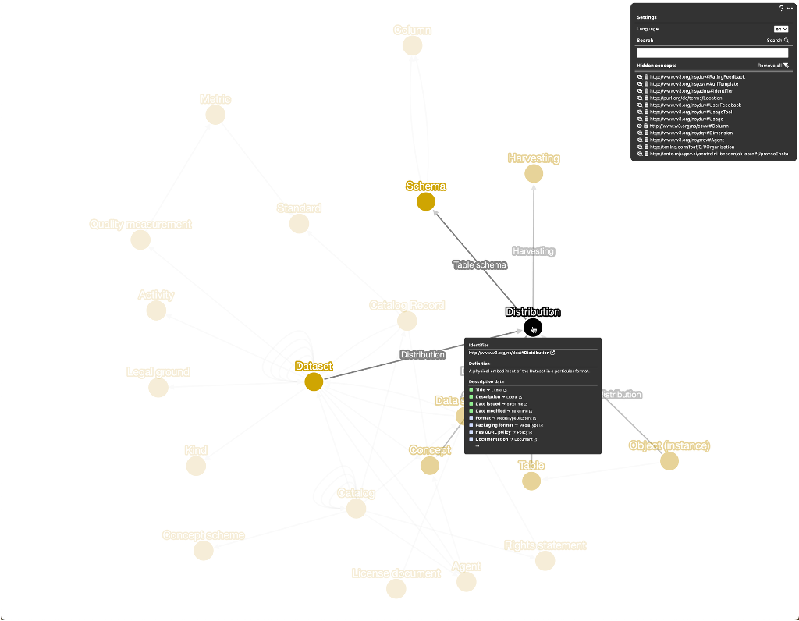
</p>

Naslednji korak demonstracije je prehod iz globalne sheme na **shemo posameznega vira**. Za izbran nabor podatkov so na voljo povezani gradniki (npr. distribucije in shema), pri čemer shema vsebuje pripadajoče metapodatke (atributi, zaloge vrednosti, omejitve).

<p align="center">
  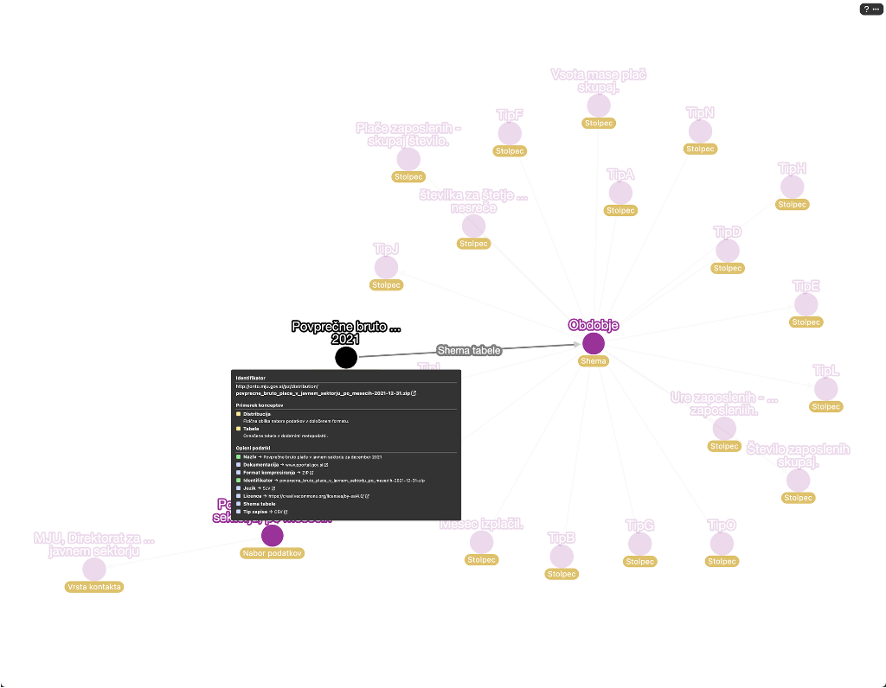
</p>

<p align="center">
  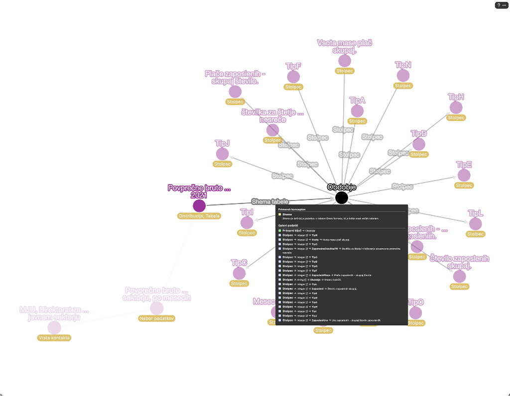
</p>

<p align="center">
  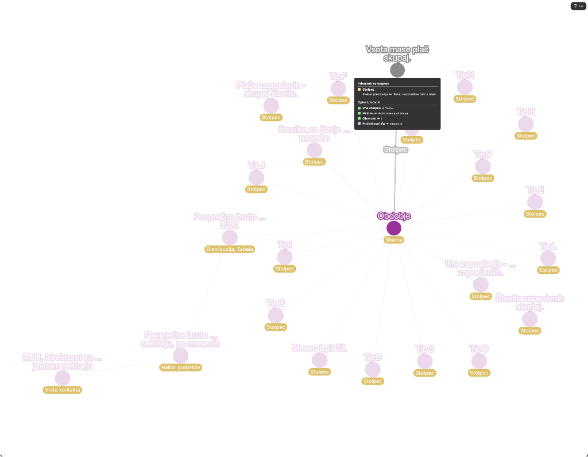
</p>

Za zaključek demonstracije si oglejmo še primer pregleda **sheme in podatkov iz več izbranih virov**. Ta pogled je še posebej uporaben, ko želimo preveriti, kako se določeni pojmi ali vrednosti pojavljajo v različnih zbirkah.

<p align="center">
  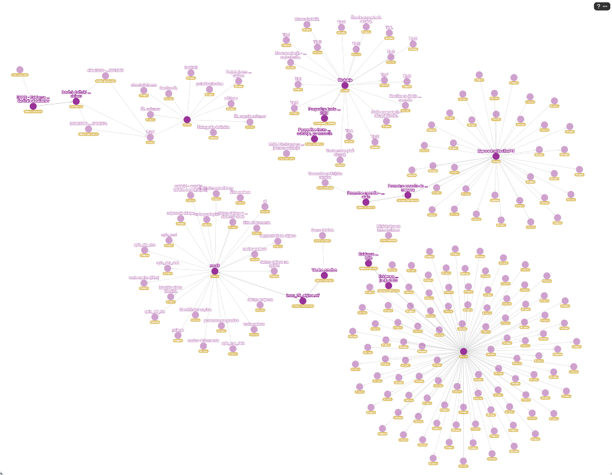
</p>

Po podatkih lahko **iščemo**: vnesemo iskalni niz in sistem izpostavi zadetke. V demonstraciji uporabimo primer niza **Primorje**.

<p align="center">
  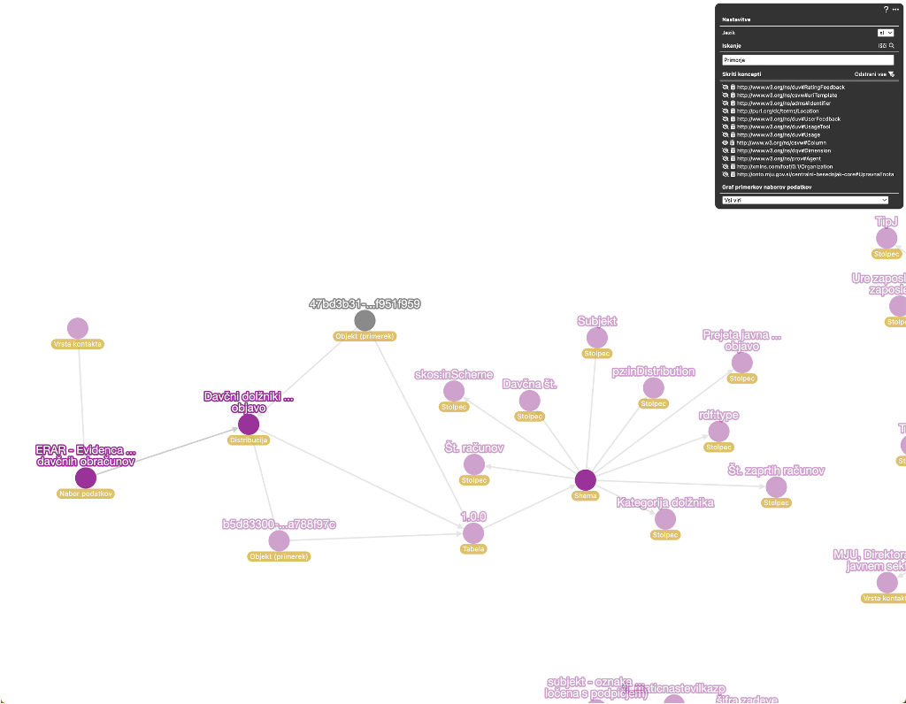
</p>

Ko odpremo podrobnosti zadetka, lahko razumemo, *kje* se niz pojavlja (npr. v atributu **dolžnik**) in kakšen je pomen tega atributa v shemi.

<p align="center">
  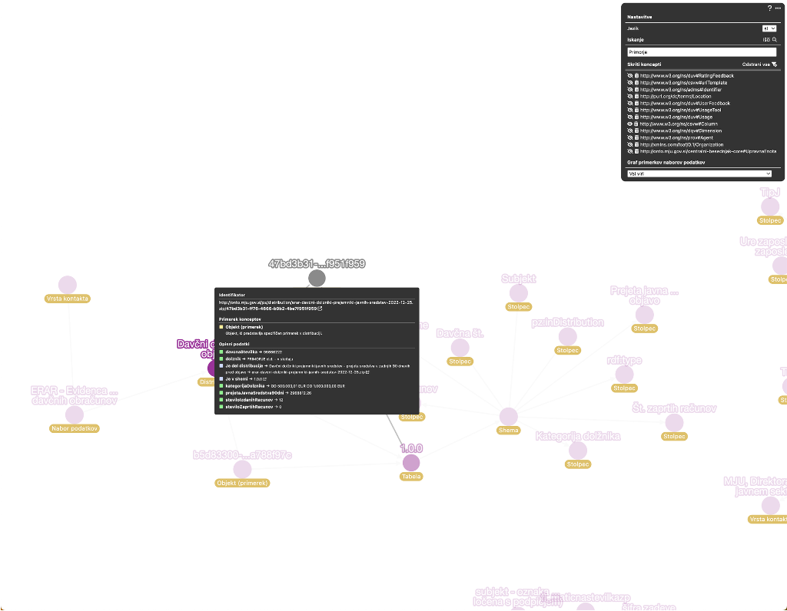
</p>

Pomemben del je tudi raziskovanje **konteksta**: iz posamezne vrednosti se lahko premaknemo do distribucije in nabora podatkov, kateremu pripada, ter razumemo, v kakšni strukturi je bila vrednost zajeta.

<p align="center">
  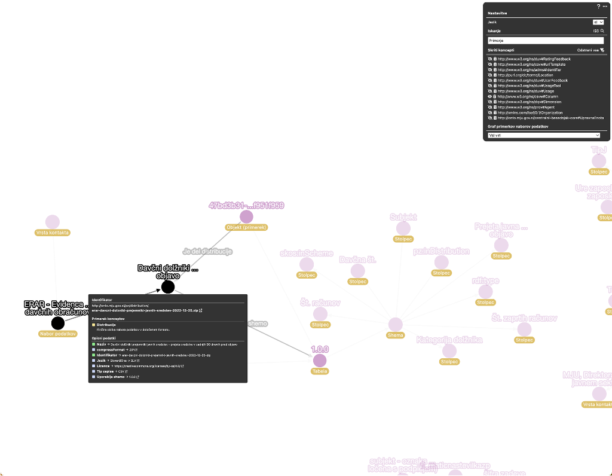
</p>

Na koncu demonstracije preverimo še, da so podatki vezani na **shemo** z jasno opredeljeno **verzijo** (npr. `v1.0.0`) ter z zahtevanimi metapodatki. To je ključno za sledljivost in stabilnost integracij, ko se sheme skozi čas nadgrajujejo.

<p align="center">
  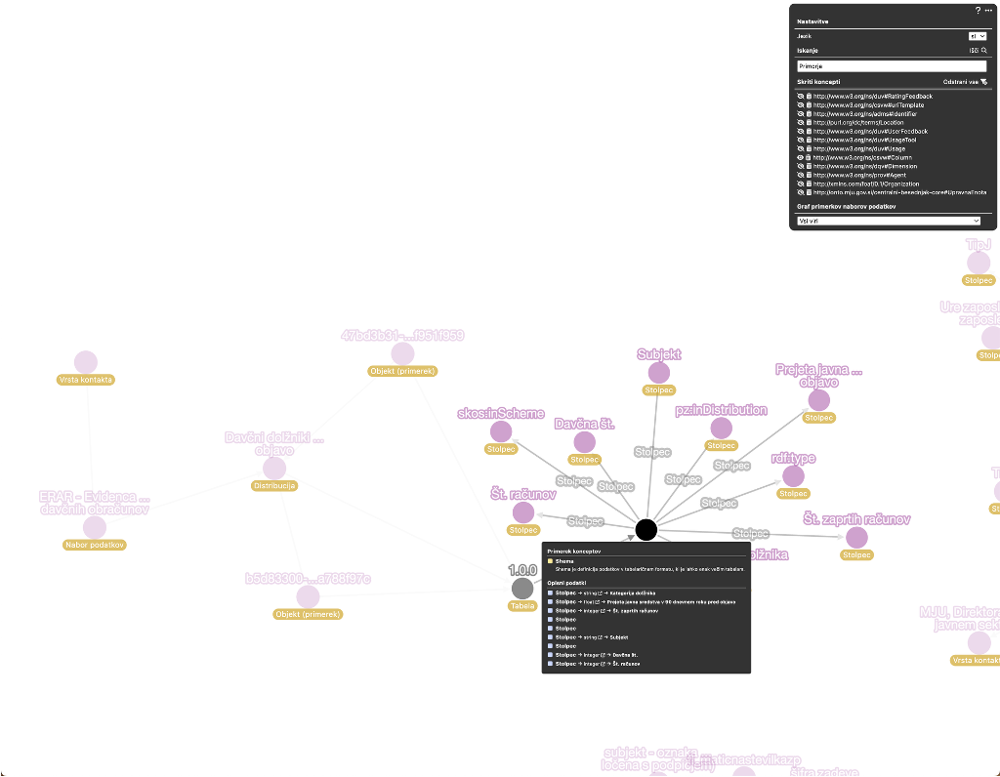
</p>

Prototip interaktivnega pregledovalnika Podatkovnega zemljevida je na voljo na [https://fri-mdp.github.io/**Podatkovni-zemljevid-2023**/**pz-viewer**/](https://fri-mdp.github.io/Podatkovni-zemljevid-2023/pz-viewer/)

</details>
