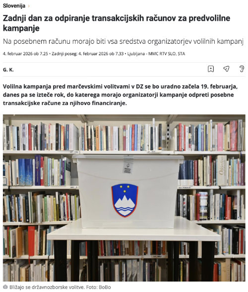

<p align="center">
  
</p>

# Delavnice semantičnega opisovanja podatkov

## Osnovni podatki

<details>
<summary>Prikaži podrobnosti</summary>

### Termini

**9. februar 2026** in **12. februar 2026** od 9:00 do 13:00 po MS Teams.

### Ciljna skupina

Zaposleni v javnem sektorju, ki želijo napredovati na področju semantičnega opisovanja podatkov in izboljšati interoperabilnost svojih podatkovnih zbirk.

### Cilji delavnice

- Omogočiti osnovno razumevanje semantične interoperabilnosti in pomena odprtih podatkov.
- Usposobiti udeležence za pretvorbo podatkov v odprte in semantično opisane formate (CSV, RDF/TTL).
- Okrepiti razumevanje uporabe URI-jev, trojčkov RDF in ontologij ter uporabo osnovnih orodij (npr. [Protégé](https://protege.stanford.edu/)).
- Spodbuditi uporabo povezanih podatkov in integracijo podatkov iz različnih virov (npr. SURS, CRP, OSM, Wikidata ipd.).
- Omogočiti izvajanje osnovnih poizvedb SPARQL ter razumevanje, kako sklepanje prinaša dodatno znanje.

### Zahteve

#### Predznanje

- Osnovno znanje o podatkovnih bazah.
- Poznavanje formatov CSV, JSON in načinov zapisovanja podatkov z omenjenima formatoma.

#### Programska oprema

- Lokalno nameščeno orodje [Protégé](https://protege.stanford.edu/) ali dostop do [WebProtégé](https://webprotege.stanford.edu/).
- Lokalno nameščeno orodje za delo z besedilnimi datotekami (npr. [VS Code](https://code.visualstudio.com/), [Notepad++](https://notepad-plus-plus.org/), [Sublime Text](https://www.sublimetext.com/) ipd.).
- Lokalno nameščena podpora za [Docker](https://docs.docker.com/desktop/) za izvajanje SPARQL poizvedb in sklepanje.

### Izvajalca

**dr. Slavko Žitnik** in **dr. Dejan Lavbič**

### Financiranje

Naročilo sofinancirata Republika Slovenija in Evropska unija iz Načrta za okrevanje in odpornost (NOO), komponenta Digitalne preobrazbe javnega sektorja in javne uprave (C2K7), ukrep Razvoj novih dinamičnih e-storitev.

</details>

## Vsebina

### 1. Uvod: Zakaj semantično opisovanje podatkov?

<details>
<summary>Prikaži podrobnosti</summary>

#### 1.1 Namen delavnice

V okviru delavnice želimo **praktično pojasniti**:

- zakaj klasično objavljanje podatkov ni dovolj,
- kako doseči višje ravni odprtosti podatkov,
- kakšen problem semantično opisovanje dejansko rešuje,
- zakaj je to še posebej pomembno za javni sektor.

Poudarek ni na tehnologiji, temveč na **problemu in dodani vrednosti**, ki jo semantično opisovanje prinaša.

#### 1.2 Motivacijski problem

Realni problem, s katerim se srečamo, je situacija, kjer podatki obstajajo, vendar iz njih težko pridobimo željene odgovore.

Primer takšnega realnega vprašanja je:

> _"Katere upravne enote imajo največ prebivalcev, katere šole imajo tam sedež in kakšna je nadmorska višina teh območij?"_

Podatki sicer že obstajajo, vendar:

- so **razpršeni** po različnih institucijah (CRP, SURS, MIZŠ, OSM, Wikidata),
- uporabljajo **različne identifikatorje**, **poimenovanja** in **strukture**,
- **niso** neposredno medsebojno **povezljivi**.

Z eno datoteko Excel ali CSV **tega vprašanja ne moremo rešiti**. Zato potrebujemo nek način, kjer podatki "govorijo isti jezik", se lahko povezujejo in so računalniku razumljivi. V tem kontekstu je **semantično opisovanje podatkov ključnega pomena**.

#### Od podatkov do znanja

Pogosto strukturirane podatke napačno interpretiramo kot semantično bogate podatke. To ne drži, saj moramo jasno razlikovati, da **struktura ne predstavlja pomena**.

| Pojem           | Primer                                                                                                                                                    |
| :-------------- | :-------------------------------------------------------------------------------------------------------------------------------------------------------- |
| **podatek**     | `298000`                                                                                                                                                  |
| **informacija** | Število prebivalcev Ljubljane.                                                                                                                            |
| **metapodatek** | Kaj ta številka pomeni, za katero leto, vir, metodologija.                                                                                                |
| **znanje**      | Sklepanje, povezovanje, odgovori na kompleksna vprašanja, npr. Ljubljana je največje mesto v Sloveniji z 298.000 prebivalci (podatki iz leta 2023, SURS). |

Zgornji primer jasno pokaže da lepo strukturirana datoteka CSV ne pove, kaj stolpci dejansko pomenijo. Struktura ≠ semantika. Brez opredeljenega pomena računalnik podatkov ne razume in jih ne more povezovati.

#### 1.3 Zakaj je to pomembno za javni sektor?

Javni sektor upravlja z **veliko količino podatkov**, ki se pogosto zbirajo večkrat, niso ponovno uporabni, niso pripravljeni za povezovanje.

Semantična interoperabilnost pri tem prinaša številne koristi, in sicer zmanjšuje podvajanje, omogoča ponovno uporabo podatkov in podpira podatkovno podprto odločanje.

Omenjen pristop je tesno povezan s strategijami in načeli, predstavljenimi v dokumentu **Podatkovnih semantičnih smernic** - cilji digitalne preobrazbe, pomenom interoperabilnosti, načeli FAIR (**F**indable, **A**ccessible, **I**nteroperable, **R**eusable) in odprtih podatkov.

#### 1.4 Kaj semantično opisovanje ni?

O semantičnem opisovanju podatkov pogosto obstajajo napačne predstave. Tukaj je nekaj **pogostih zmot**:

- ❌ _"To je samo za raziskovalce."_
- ❌ _"To pomeni, da moramo najprej narediti ontologijo."_
- ❌ _"To je preveč kompleksno za praktično uporabo."_

Ključno vodilo delavnice je:

> _Ne gradimo ontologije - rešujemo problem povezovanja podatkov za namen odgovarjanja na kompleksna vprašanja._

#### 1.5 Intuitivne razlage ključnih pojmov

Pri delavnici bomo uporabljali preproste in intuitivne razlage ključnih pojmov, kot so:

Pojem | Razlaga
:-----|:---------
**URI (Uniform Resource Identifier)** | Enoličen in nespremenljiv naslov (ne le ID v tabeli), ki identificira vir (npr. občino, šolo) na spletu.
**RDF (Resource Description Framework)** | Način, kako računalniku predstavimo "kdo je kdo, kako so stvari povezane" z uporabo trojčkov (subjekt, predikat, objekt).
**Ontologija** | Formalen opis pojmov in njihovih medsebojnih odnosov v določenem področju (npr. občine, šole).
**SPARQL** | Jezik za poizvedovanje po semantično opisanih podatkih. Npr. Google (v kontekstu spletnih strani) oz. SQL (v kontekstu relacijskih baz) za grafovsko urejene podatke.
**Povezani podatki (Linked Data)** | Podatki, ki so medsebojno povezani z uporabo URI-jev, kar omogoča integracijo in kontekstualizacijo iz različnih virov. Način, s katerim lahko samodejno pridobimo podatke iz zunanjih virov (npr. [Wikidata](https://www.wikidata.org/)).

#### 1.6 Praktični primer

Če pogledamo poljuben članek na spletni strani [RTV Slovenije](https://www.rtvslo.si/), npr. [Zadnji dan za odpiranje transakcijskih računov za predvolilne kampanje](https://www.rtvslo.si/slovenija/zadnji-dan-za-odpiranje-transakcijskih-racunov-za-predvolilne-kampanje/772271), lahko opazimo, da je delno semantično opisan z namenom olajšanja iskanja in povezovanja vsebin, kot to prikazuje naslednja slika.

<p align="center">
  <br>
  Vizualizacija novice iz <a href="https://www.rtvslo.si/slovenija/zadnji-dan-za-odpiranje-transakcijskih-racunov-za-predvolilne-kampanje/772271" target="_blank">RTV SLO</a>
</p>

Izvorna koda novice iz [RTV SLO](https://www.rtvslo.si/slovenija/zadnji-dan-za-odpiranje-transakcijskih-racunov-za-predvolilne-kampanje/772271) vsebuje naslednji del z uporabo [JSON-LD](https://json-ld.org/) za semantično opisovanje vsebine novice:

```html
<!DOCTYPE html>
<html lang="sl">
  <head>
  ...
  <script type="application/ld+json">
    {
      "@context": "https://schema.org",
      "@type": "NewsArticle",
      "mainEntityOfPage": {
        "@type": "WebPage",
        "@id": "https://www.rtvslo.si/slovenija/zadnji-dan-za-odpiranje-transakcijskih-racunov-za-predvolilne-kampanje/772271"
      },
      "headline": "Zadnji dan za odpiranje transakcijskih računov za predvolilne kampanje",
      "image": [
        "https://img.rtvcdn.si/_up/upload/2025/11/23/66997310_fp-fb.jpg"
      ],
      "datePublished": "2026-02-04 07:25:17",
      "dateModified": "2026-02-04 07:33:56",
      "author": {
        "@type": "Person",
        "name": "G. K.",
        "url": "https://www.rtvslo.si"
      },
      "publisher": {
        "@type": "Organization",
        "name": "RTV Slovenija",
        "logo": {
          "@type": "ImageObject",
          "url": "https://img.rtvslo.si/_static/novi/logo/md_RTVSLO-logo-color.png"
        }
      }
    }
  </script>
  </head>
  <body>
    ...
  </body>
</html>
```

Opazimo lahko, da je novica semantično opisana z uporabo standarda [schema.org](https://schema.org/), ki omogoča enostavno razumevanje vsebine tako ljudem kot računalnikom, kar se pogosto uporablja pri objavi splošnih podatkov na svetovnem spletu.

V tem konkretnem primeru so uporabljeni pojmi, kot so [`NewsArticle`](https://schema.org/NewsArticle) (novica), [`headline`](https://schema.org/headline) (naslov), [`image`](https://schema.org/image) (slika), [`datePublished`](https://schema.org/datePublished) (datum objave), [`author`](https://schema.org/author) (avtor) in [`publisher`](https://schema.org/publisher) (izdajatelj). Ti pojmi omogočajo strukturirano predstavitev ključnih informacij o novici, kar olajša iskanje, indeksiranje in povezovanje z drugimi vsebinami na spletu.

</details>

### 2. Od izvornih podatkov do 5 ★ odprtosti podatkov

Cilj delavnice bo predvsem pojasniti, kako iz razdrobljenih javnih podatkov dobimo odgovore, ki jih iz posamezne zbirke ne moremo pridobiti. Pri tem pogosto govorimo o [ravneh odprtosti podatkov](https://5stardata.info/), predstavljene v naslednji tabeli.

| Raven | Opis                                                                                   | Primer                                                                                    |
| :---- | :------------------------------------------------------------------------------------- | :---------------------------------------------------------------------------------------- |
| ★     | Podatki so objavljeni na spletu (v poljubnem formatu) pod odprto licenco.              | Poročilo v obliki PDF o občinskih proračunih na spletni strani občine.                    |
| ★★    | Podatki so strukturirani (npr. Excel namesto skeniranega dokumenta).                   | Excel tabela z javnimi naročili.                                                          |
| ★★★   | Podatki so v odprtem formatu (npr. CSV namesto Excel).                                 | Datoteka CSV s statistiko prebivalstva iz SURS-a.                                         |
| ★★★★  | Podatki uporabljajo URI-je za enolično identifikacijo pojmov, kar omogoča povezovanje. | Nabor podatkov o občinah, kjer ima vsaka občina svoj URI.                                 |
| ★★★★★ | Podatki so povezani z drugimi viri, kar omogoča kontekstualizacijo.                    | Podatki o šolah, povezani z prostorskimi podatki, standardi izobraževanja in demografijo. |

### 3. Raven 4 ★: semantični opis podatkov z RDF

### 4. Formalizacija podatkovnega modela z ontologijami

### 5. Raven 5 ★: povezani podatki in zunanji viri

### 6. Uporaba semantično opisanih podatkov s SPARQL

### 7. Sklepanje: prehod od podatkov k znanju

### 8. Vizualizacija in integracija v aplikacije

### 9. Povzetek in nadaljnji koraki
